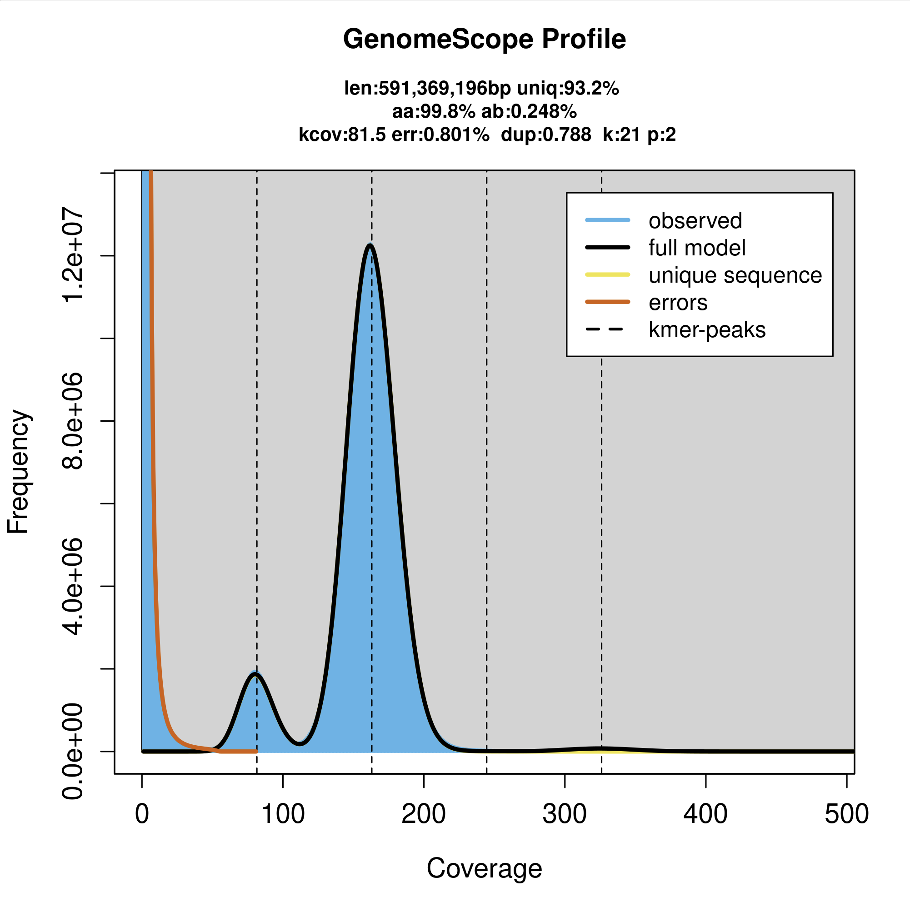
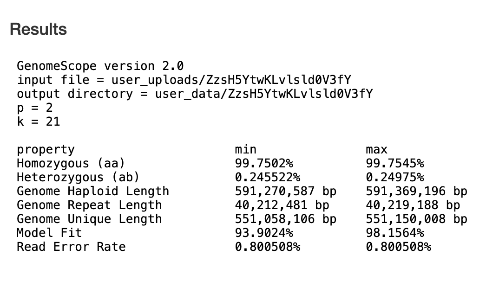

# Get basecalled data from Miten
```
wget https://s3.amazonaws.com/gtl-public-data/miten/remy/03_24_25_R10_HCI_CUR_092401_GENOME.5mC_5hmC.sup.dorado.0.9.1.bam hughes.annab@xfer.discovery.neu.edu:/work/gatins/hci_genome/bams
wget https://s3.amazonaws.com/gtl-public-data/miten/remy/03_24_25_R10_HCI_CUR_092401_GENOME_SS.5mC_5hmC.sup.dorado.0.9.1.bam hughes.annab@xfer.discovery.neu.edu:/work/gatins/hci_genome/bams
```
let's store this data in an untouched 'bams' directory and also make a copy to work with in a 'processing' directory
```
cp /work/gatins/hci_genome/bams/03_24_25_R10_HCI_CUR_092401_GENOME.5mC_5hmC.sup.dorado.0.9.1.bam /work/gatins/hci_genome/processing
cp /work/gatins/hci_genome/bams/03_24_25_R10_HCI_CUR_092401_GENOME_SS.5mC_5hmC.sup.dorado.0.9.1.bam /work/gatins/hci_genome/processing
```
compressing original files to save storage space
- job name: tar_gzip_bams
- job id: 48012219
- run time: 02:03:15
```
tar -zcvf /work/gatins/hci_genome/HCI_CUR_092401_ONT_bams.gz /work/gatins/hci_genome/bams
```
renaming the bams I will work with in the /processing directory for simplicity
```
mv 03_24_25_R10_HCI_CUR_092401_GENOME.5mC_5hmC.sup.dorado.0.9.1.bam fc1.bam
mv 03_24_25_R10_HCI_CUR_092401_GENOME_SS.5mC_5hmC.sup.dorado.0.9.1.bam fc2_SS.bam
```

# Use samtools to convert bam --> fastq
- job name: bam2fastq
- job id:48007076
- run time: 01:15:41
```
module load samtools/1.9
samtools bam2fq fc1.bam > hci1.fastq
samtools bam2fq fc2_SS.bam > hci2.fastq
```

# Check stats from each fastq using [NanoStat](https://github.com/wdecoster/nanostat) OR [SeqKit](https://bioinf.shenwei.me/seqkit/usage/)
- job name: flowcell_stats
- job id: 48011288
- run time: 02:54:42
```
module load anaconda3/2022.05
source activate /work/gatins/hci_genome/env
NanoStat --fastq /work/gatins/hci_genome/processing/hci1.fastq --outdir /work/gatins/hci_genome/processing/statreports --name hci1_Nanostat_fastqreport
NanoStat --fastq /work/gatins/hci_genome/processing/hci2.fastq --outdir /work/gatins/hci_genome/processing/statreports --name hci2_Nanostat_fastqreport
```
I'm curious about the difference in outputs from NanoStat and seqkit so let's run seqkit too
- job name: stats_seqkit
- job id: 48021445
- run time: 00:07:34
```
module load anaconda3/2022.05
source activate /work/gatins/hci_genome/env
seqkit stat /work/gatins/hci_genome/processing/*.fastq
```

# Trim Adapters with [Porechop](https://github.com/rrwick/Porechop)
Porechop uses a lot of memory, so it is going to be really challenging to run on a concatenated file. I submitted a batch job on April 10 for hci1.fastq asking for 800G of memory (it is still in the queue) and I'm now interactively running Porechop on hci2.fastq with 300G of memory. **this step takes longer than 4 hours (short partition default), so make sure to indicate longer runtimes!**
```
srun --partition=short --nodes=1 --cpus-per-task=1 --mem=300G --time=48:00:00 --pty /bin/bash
porechop -i hci2.fastq -o hci2_noadapters.fastq
```
- job name: porechop1
- job id: 48049716
- run time: 20:39:38
```
module load anaconda3/2022.05
source activate /work/gatins/hci_genome/env
porechop -i /work/gatins/hci_genome/processing/hci1.fastq -o hci1_noadapters.fastq
```

# Concatenate to one big file
now that things look good after Porechop, let's concatenate before we filter and assemble
```
cat hci1_noadapters.fastq hci2_noadapters.fastq > hci_concat_noadapters.fastq
```

# Filter with SeqKit
we're filtering to a minimum sequence length of 2000 and minimum Q-score of 3 (I also allocated 10 threads to try and speed up the process). I also ran the concatenate function above with the seqkit filtering step as a batch job together:
- job name: concatenate_filter
- job id: 48175086
- run time: 00:33:29
```
module load anaconda3/2022.05 discovery
source activate /work/gatins/hci_genome/env
cat /work/gatins/hci_genome/processing/hci1_noadapters.fastq /work/gatins/hci_genome/processing/hci2_noadapters.fastq > /work/gatins/hci_genome/processing/hci_concat_noadapters.fastq
cat /work/gatins/hci_genome/processing/hci_concat_noadapters.fastq | seqkit seq -m 2000 -Q 3 -j 10 > /work/gatins/hci_genome/processing/hci_filtered_2kQ3.fastq
```
running stats on filtered output (saved output as .txt file)
```
seqkit stats hci_filtered_2kQ3.fastq -a
```

# Estimate genome size with [Jellyfish](https://github.com/gmarcais/Jellyfish) (k=21)
- job name: jellyfish
- job id: 48198203
- run time: 03:08:30
```
module load jellyfish/2.2.10
jellyfish count -m 21 -s 100M -t 10 -C -o hci_21mer_output /work/gatins/hci_genome/processing/hci_filtered_2kQ3.fastq
```
```
jellyfish histo mer_counts.jf
```
Upload this histogram file to [GenomeScope](http://genomescope.org/genomescope2.0/) to look at sequencing coverage and get a genome size estimate.
- Description: HCI_CUR_092401
- K-mer length: 21
- Ploidy: 2
- Max k-mer coverage: -1 (left at default)
- Average k-mer coverage for polyploid genome: -1 (left at default)



# ASSEMBLIES
## Method 1: [Flye](https://github.com/mikolmogorov/Flye)
Creating an initial assembly with the 2kQ3 filtered dataset created above. Requested 500G RAM and 32 threads:
- job name: assembly_flye
- job id: 48197184
- run time: 21:31:05
```
flye --nano-raw /work/gatins/hci_genome/processing/hci_filtered_2kQ3.fastq --threads 32 --out-dir /work/gatins/hci_genome/processing/assembly_Flye
```
### Running [BUSCO](https://busco.ezlab.org/busco_userguide.html#tips-for-running-busco)
first, find which dataset to run Busco against
```
busco --list-datasets
```
running against the **actinopterygii_odb12** dataset
- job name: busco_initial_assembly_flye
- job id: 48238947
- run time: 00:46:58
```
module load anaconda3/2022.05
source activate medaka
busco -i /work/gatins/hci_genome/processing/assembly_Flye/assembly.fasta --mode genome --lineage_dataset actinopterygii_odb12 --cpu 25 --out initial_assembly_flye_busco
```
**will repeat this same BUSCO check after each assembly trial**


|  file    | format | type | num_seqs  |  sum_len | min_len   |   avg_len  |   max_len   |    Q1   |     Q2    |     Q3 | sum_gap   |  N50 | N50_num | Q20(%) | Q30(%) | AvgQual | GC(%) | sum_n | BUSCO |
|----------|---------------|------|-----------|------------|-----------|------------|-------------|---------|-----------|--------|-----------|---------|---------|--------|--------|---------|-------|-------|------|
|assembly_Flye/assembly.fasta | FASTA |  DNA   |   624 | 594,359,000   |   283 | 952,498.4 | 23,379,083 | 3,326.5 | 9,735 | 479,921.5    |    0 | 5,707,192    |   25   |    0    |   0    |    0 | 41.39   |   0| 98.6% |


## Method 2: Flye + polish with [Medaka](https://github.com/nanoporetech/medaka) (ONT recommendation) 
### polish with Medaka
Polishing my initial Flye assembly (assembly_Flye/assembly.fasta) with Medaka. I'm not positive about the basecaller model... but got it from Dorado github. to find model list:
```
medaka tools list\_models
```
- job name: medaka_polish
- job id: 48241944
- run time: 2-00:00:00 and  it didn't finish! TIMEOUT
```
medaka_consensus -i /work/gatins/hci_genome/processing/hci_concat_noadapters.fastq -d /work/gatins/hci_genome/processing/assembly_Flye/assembly.fasta -o medaka_out -t 32 -m r1041_e82_400bps_sup_v5.0.0
```

## Method 3: [Hifiasm](https://github.com/chhylp123/hifiasm)
- job name: hifiasm_assembly
- job id: 48242171
- run time: 18:00:21
```
module load anaconda3/2022.05
source activate /work/gatins/hci_genome/env
hifiasm -o assembly_hifiasm.asm --ont -t32 /work/gatins/hci_genome/processing/hci_filtered_2kQ3.fastq
```

|  file    | format | type | num_seqs  |  sum_len | min_len   |   avg_len  |   max_len   |    Q1   |     Q2    |     Q3 | sum_gap   |  N50 | N50_num | Q20(%) | Q30(%) | AvgQual | GC(%) | sum_n | BUSCO |
|----------|---------------|------|-----------|------------|-----------|------------|-------------|---------|-----------|--------|-----------|---------|---------|--------|--------|---------|-------|-------|------|
|test_hifiasm.fa | FASTA  | DNA  |      338 | 608,394,079  |  3,041 | 1,799,982.5 | 31,942,965 | 5,485 | 8,522 | 16,083   |     0 | 26,222,608   |    11   |    0   |    0    |    0 | 41.43  |    0 | 98.8% |

## Method 4: Flye with harsher filtering
Using seqkit, I refiltered with harsher criteria to try and achieve an assembly with fewer contigs.
- job name: filter_2.5kQ5
- job id: 48242201
- run time: 00:17:17
```
module load anaconda3/2022.05 discovery
source activate /work/gatins/hci_genome/env
cat /work/gatins/hci_genome/processing/hci_concat_noadapters.fastq | seqkit seq -m 2500 -Q 5 -j 10 > /work/gatins/hci_genome/processing/hci_filtered_2.5kQ5.fastq
```
Now, I will re-assemble with Flye with this new filtered data
- job name: assembly_flye_2.5kQ5
- job id: 48242538
- run time: 14:49:18
```
flye --nano-raw /work/gatins/hci_genome/processing/hci_filtered_2.5kQ5.fastq --threads 32 --out-dir /work/gatins/hci_genome/processing/assembly_Flye_2.5kQ5
```
```
seqkit stats assembly.fasta -a
```

|  file    |        format | type | num_seqs  |    sum_len | min_len   |   avg_len  |   max_len   |    Q1   |     Q2    |     Q3 | sum_gap   |     N50 | N50_num | Q20(%) | Q30(%) | AvgQual | GC(%) | sum_n | BUSCO |
|----------|---------------|------|-----------|------------|-----------|------------|-------------|---------|-----------|--------|-----------|---------|---------|--------|--------|---------|-------|-------|-------|
|assembly_Flye_2.5kQ5/assembly.fasta | FASTA |  DNA   |   432 | 594,482,202   |   545 | 1,376,116.2 | 22,923,120 | 5,083.5 | 16,907.5 | 797,175.5   |    0 | 9,307,019   |    21    |   0    |   0    |   0 | 41.38   |   0 |  | 98.7%


now let's check and make sure the adapters came off with [FCS](https://github.com/ncbi/fcs) from NCBI
```
module load singularity/3.10.3
curl -LO https://github.com/ncbi/fcs/raw/main/dist/run_fcsadaptor.sh
chmod 755 run_fcsadaptor.sh
curl https://ftp.ncbi.nlm.nih.gov/genomes/TOOLS/FCS/releases/latest/fcs-adaptor.sif -Lo fcs-adaptor.sif
```
testing on assembly #4:
```
mkdir fcs_output
./run_fcsadaptor.sh --fasta-input /work/gatins/hci_genome/processing/assembly_Flye_2.5kQ5/assembly.fasta --output-dir /work/gatins/hci_genome/processing/fcs_output --euk --container-engine singularity --image fcs-adaptor.sif
```
Output (fcs_adaptor_report.txt):
| accession	| length	| action	| range	| name |
|-----------|---------|---------|-------|------|
|contig_1435	| 1811395	| ACTION_TRIM	| 141196..141220	| CONTAMINATION_SOURCE_TYPE_ADAPTOR:NGB00972.1:Pacific Biosciences Blunt Adapter |

I'm not sure why it detected a PacBio adapter in my assembly... Let's test it on the other assemblies. Assembly 1:
```
mkdir fcs2_output
./run_fcsadaptor.sh --fasta-input /work/gatins/hci_genome/processing/assembly_Flye/assembly.fasta --output-dir /work/gatins/hci_genome/processing/fcs2_output --euk --container-engine singularity --image fcs-adaptor.sif
```
Output (fcs_adaptor_report.txt):
| accession	| length	| action	| range	| name |
|-----------|---------|---------|-------|------|

No contamination detected here...??? Testing Hifiasm assembly now:
```
mkdir fcs3_output
./run_fcsadaptor.sh --fasta-input test_hifiasm.fa --output-dir /work/gatins/hci_genome/processing/fcs3_output --euk --container-engine singularity --image fcs-adaptor.sif
```
No contamination detected. Going to investigate.

# Contamination Identification with [Kraken2](https://github.com/DerrickWood/kraken2/blob/master/docs/MANUAL.markdown)
First, I will create the standard Kraken2 database which contains "NCBI taxonomic information, as well as the complete genomes in RefSeq for the bacterial, archaeal, and viral domains, along with the human genome and a collection of known vectors (UniVec_Core)." I allocated 250G of memory to this job to try and build the database quickly.
- job name: kraken2db
```
module load anaconda3/2022.05
source activate /work/gatins/hci_genome/env
/work/gatins/hci_genome/kraken2/kraken2-build --standard --threads 32 --db /work/gatins/hci_genome/processing/kraken2_standard_db --use-ftp
```
This quit in the middle of downloading the archaea database. Going to run each individually instead as follows:
```
module load anaconda3/2022.05
source activate /work/gatins/hci_genome/env
#./kraken2-build --threads 6 --use-ftp --db /work/gatins/hci_genome/processing/kraken2_standard_db --download-library archaea
#./kraken2-build --threads 6 --use-ftp --db /work/gatins/hci_genome/processing/kraken2_standard_db --download-library viral
#./kraken2-build --threads 6 --use-ftp --db /work/gatins/hci_genome/processing/kraken2_standard_db --download-library bacteria
#./kraken2-build --threads 6 --use-ftp --db /work/gatins/hci_genome/processing/kraken2_standard_db --download-library plasmid
#./kraken2-build --threads 6 --use-ftp --db /work/gatins/hci_genome/processing/kraken2_standard_db --download-library human --no-mask
```

Now let's generate a report by running the Hifiasm assembly against this database:
```
/work/gatins/hci_genome/kraken2/kraken2 --threads 20 --db /work/gatins/hci_genome/processing/kraken2_standard_db --output kraken2_hifiasm.output.txt --report kraken2_hifiasm.report.txt work/gatins/hci_genome/processing/test_hifiasm.fa
```
