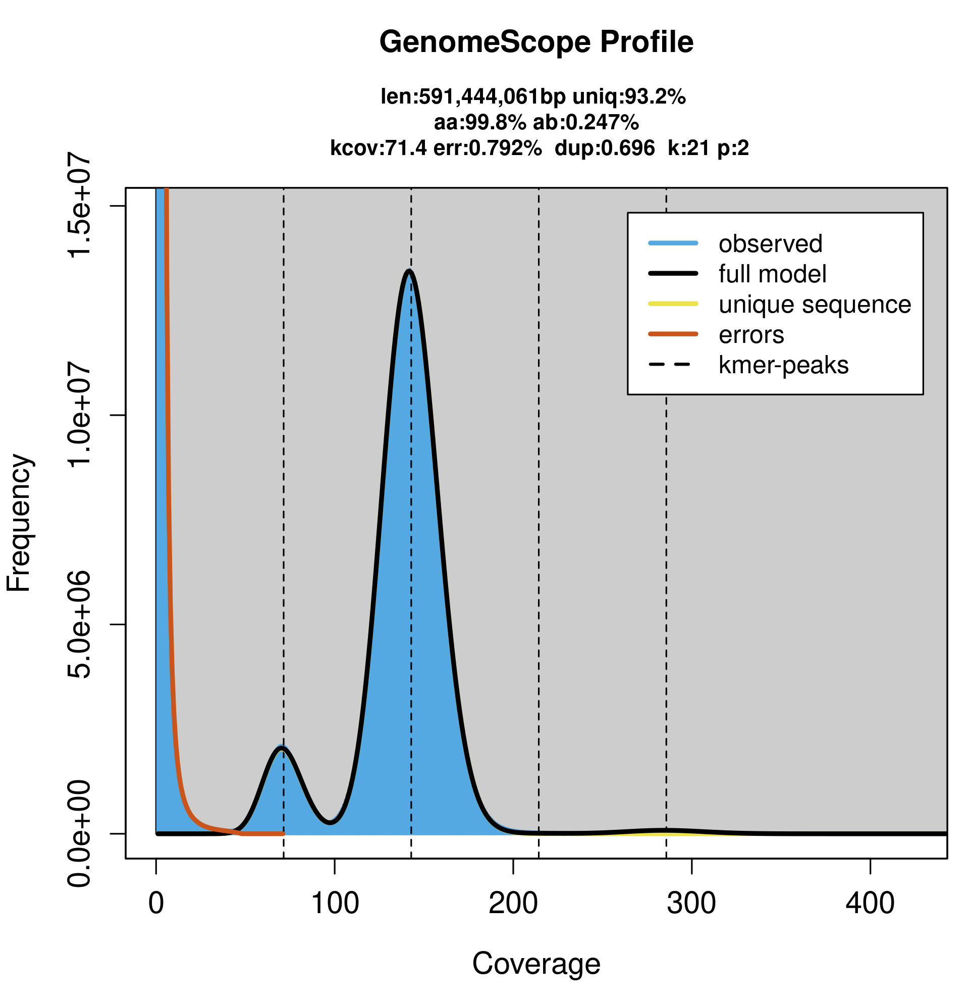
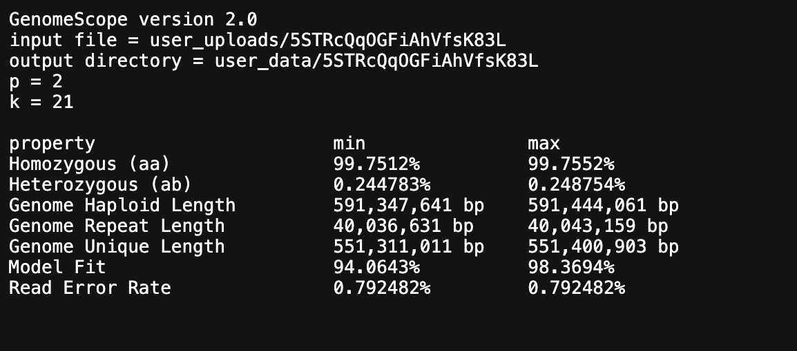
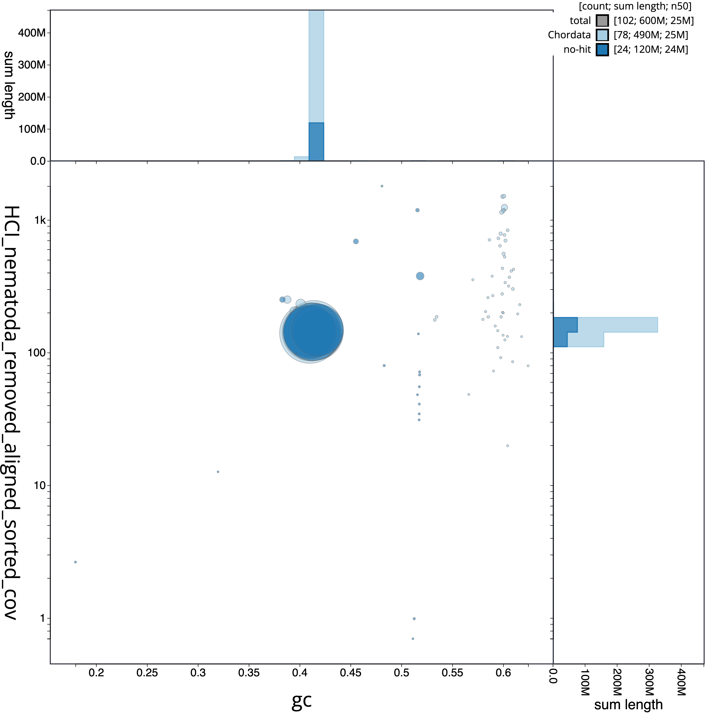
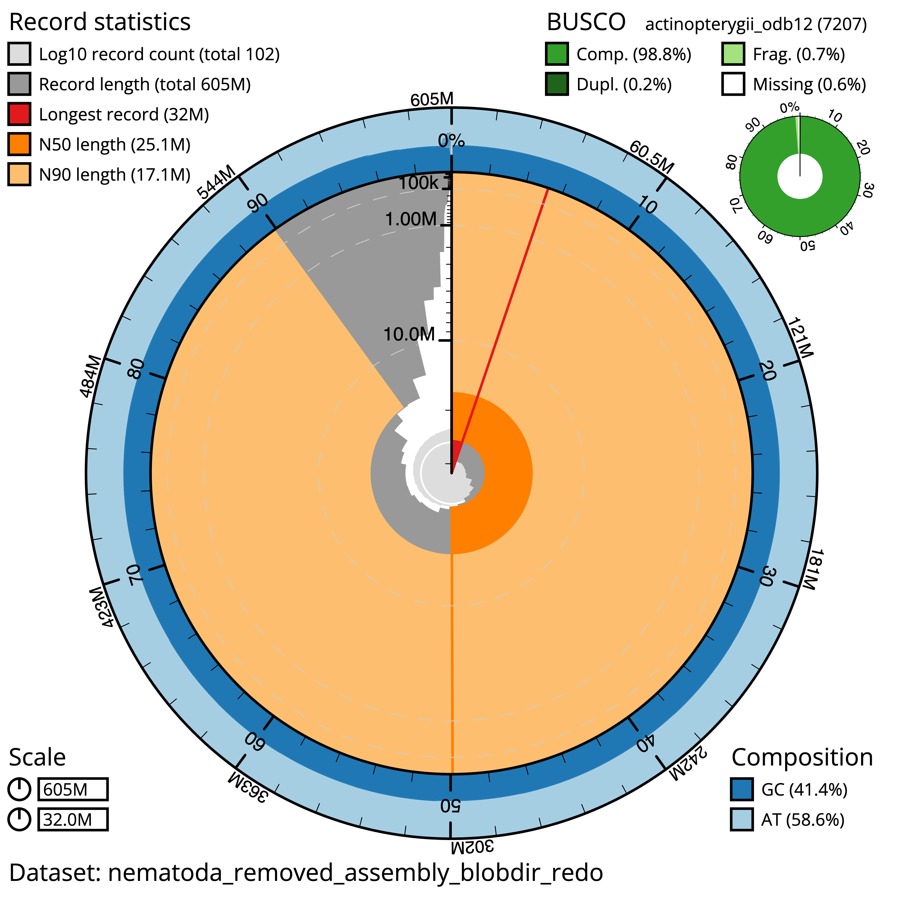
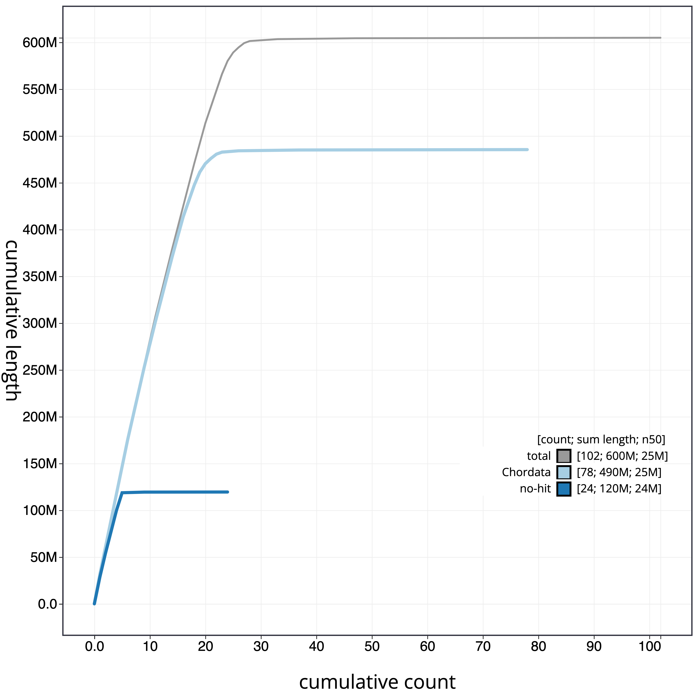

# Reference Genome Assembly for the Queen Angelfish (*Holacanthus ciliaris*)

## 1. Get basecalled data from Miten
```
wget https://s3.amazonaws.com/gtl-public-data/miten/remy/03_24_25_R10_HCI_CUR_092401_GENOME.5mC_5hmC.sup.dorado.0.9.1.bam hughes.annab@xfer.discovery.neu.edu:/work/gatins/hci_genome/bams
wget https://s3.amazonaws.com/gtl-public-data/miten/remy/03_24_25_R10_HCI_CUR_092401_GENOME_SS.5mC_5hmC.sup.dorado.0.9.1.bam hughes.annab@xfer.discovery.neu.edu:/work/gatins/hci_genome/bams
```
let's store this data in an untouched 'bams' directory and also make a copy to work with in a 'processing' directory
```
cp /work/gatins/hci_genome/bams/03_24_25_R10_HCI_CUR_092401_GENOME.5mC_5hmC.sup.dorado.0.9.1.bam /work/gatins/hci_genome/processing
cp /work/gatins/hci_genome/bams/03_24_25_R10_HCI_CUR_092401_GENOME_SS.5mC_5hmC.sup.dorado.0.9.1.bam /work/gatins/hci_genome/processing
```
compressing original files to save storage space
- job name: tar_gzip_bams
- job id: 48012219
- run time: 02:03:15
```
tar -zcvf /work/gatins/hci_genome/HCI_CUR_092401_ONT_bams.gz /work/gatins/hci_genome/bams
```
renaming the bams I will work with in the /processing directory for simplicity
```
mv 03_24_25_R10_HCI_CUR_092401_GENOME.5mC_5hmC.sup.dorado.0.9.1.bam fc1.bam
mv 03_24_25_R10_HCI_CUR_092401_GENOME_SS.5mC_5hmC.sup.dorado.0.9.1.bam fc2_SS.bam
```

## 2. Use samtools to convert bam --> fastq
- job name: bam2fastq
- job id:48007076
- run time: 01:15:41
```
module load samtools/1.9
samtools bam2fq fc1.bam > hci1.fastq
samtools bam2fq fc2_SS.bam > hci2.fastq
```

## 3. Check stats from each fastq 
We can use [NanoStat](https://github.com/wdecoster/nanostat) OR [SeqKit](https://bioinf.shenwei.me/seqkit/usage/). Let's test NanoStat first:
- job name: flowcell_stats
- job id: 48011288
- run time: 02:54:42
```
module load anaconda3/2022.05
source activate /work/gatins/hci_genome/env
NanoStat --fastq /work/gatins/hci_genome/processing/hci1.fastq --outdir /work/gatins/hci_genome/processing/statreports --name hci1_Nanostat_fastqreport
NanoStat --fastq /work/gatins/hci_genome/processing/hci2.fastq --outdir /work/gatins/hci_genome/processing/statreports --name hci2_Nanostat_fastqreport
```
I'm curious about the difference in outputs from NanoStat and SeqKit so let's run SeqKit too
- job name: stats_seqkit
- job id: 48021445
- run time: 00:07:34
```
module load anaconda3/2022.05
source activate /work/gatins/hci_genome/env
seqkit stat /work/gatins/hci_genome/processing/*.fastq
```

## 4. Trim Adapters with [Porechop](https://github.com/rrwick/Porechop)
Porechop uses a lot of memory, so it is going to be really challenging to run on a concatenated file. I submitted a batch job on April 10 for hci1.fastq asking for 800G of memory (it is still in the queue) and I'm now interactively running Porechop on hci2.fastq with 300G of memory. **this step takes longer than 4 hours (short partition default), so make sure to indicate longer runtimes!**
```
srun --partition=short --nodes=1 --cpus-per-task=1 --mem=300G --time=48:00:00 --pty /bin/bash
porechop -i hci2.fastq -o hci2_noadapters.fastq
```
- job name: porechop1
- job id: 48049716
- run time: 20:39:38
```
module load anaconda3/2022.05
source activate /work/gatins/hci_genome/env
porechop -i /work/gatins/hci_genome/processing/hci1.fastq -o hci1_noadapters.fastq
```

## 5. Concatenate to one big file
now that things look good after Porechop, let's concatenate before we filter and assemble
```
cat hci1_noadapters.fastq hci2_noadapters.fastq > hci_concat_noadapters.fastq
```

## 6. Filter with SeqKit
We're filtering to a minimum sequence length of 2500 bp and a minimum quality score of Q5.
- job name: filter_2.5kQ5
- job id: 48242201
- run time: 00:17:17
```
module load anaconda3/2022.05 discovery
source activate /work/gatins/hci_genome/env
cat /work/gatins/hci_genome/processing/hci_concat_noadapters.fastq | seqkit seq -m 2500 -Q 5 -j 10 > /work/gatins/hci_genome/processing/hci_filtered_2.5kQ5.fastq
```

## 7. Estimate genome size with [Jellyfish](https://github.com/gmarcais/Jellyfish) (k=21)
- job name: jellyfishQ5
- job id: 48316419
- run time: 02:12:55
```
module load jellyfish/2.2.10
jellyfish count -m 21 -s 500M -t 10 -C -o hciQ5_21mer_output /work/gatins/hci_genome/processing/hci_filtered_2.5kQ5.fastq
```
```
jellyfish histo hciQ5_21mer_output
```
Upload this histogram file to [GenomeScope](http://genomescope.org/genomescope2.0/) to look at sequencing coverage and get a genome size estimate.
- Description: HCI_CUR_092401
- K-mer length: 21
- Ploidy: 2
- Max k-mer coverage: -1 (left at default)
- Average k-mer coverage for polyploid genome: -1 (left at default)



## 8. Removal of mitochondrial DNA before genome assembly
My first attempt at assembling left me with >60 contigs assembled that mapped to the *H. ciliaris* mitogenome. In order to decrease mismappings and false assemblies, I'm removing the mtDNA before assembling.
### Download mitochondrial sequence from NCBI
>NC_027595.1_HCI_mito.fasta

### Use minimap2 to map filtered fastq reads pre-assembly (hci_filtered_2.5kQ5.fastq) to reference mitochondrial sequence (NC_027595.1_HCI_mito.fasta)
```
module load minimap2/2.26
minimap2 -t 40 -ax map-ont NC_027595.1_HCI_mito.fasta hci_filtered_2.5kQ5.fastq > aln_minimap2.sam
```
### Use samtools to extract sequences that mapped to mitochondrial genome
Convert to BAM, then sort and index
- job name: convert_bam_sort_index
- job id: 48549448
- run time: 00:47:21
```
module load samtools/1.19.2
samtools view -Sb -@ 30 aln_minimap2.sam > mtdna_aligned.bam
samtools sort -@ 20 mtdna_aligned.bam -o mito_aln.sorted.bam
samtools index mito_aln.sorted.bam
```
Extract sequences that were unmapped and save them to a new BAM file
```
samtools view -b -f 4 -@ 20 mito_aln.sorted.bam > unmapped.bam
```
Convert BAM to FASTQ
```
samtools fastq unmapped.bam > reads_no_mito.fastq
```

## 9. Assemble with [hifiasm](https://github.com/chhylp123/hifiasm)
- job name: hifiasm_assembly_nomt
- job id: 48558478
- run time: 14:14:41
```
module load anaconda3/2022.05
source activate /work/gatins/hci_genome/env
hifiasm -o assembly_hifiasm_no_mito.asm --ont -t32 /work/gatins/hci_genome/processing/mtdna/removal/reads_no_mito.fastq
```
### Running [BUSCO](https://busco.ezlab.org/busco_userguide.html#tips-for-running-busco)
first, find which dataset to run Busco against
```
busco --list-datasets
```
running against the **actinopterygii_odb12** dataset
- job name: busco_hifiasm_nomito
- job id: 48580072
- run time: 00:35:52
```
module load anaconda3/2022.05
source activate /work/gatins/hci_genome/busco
busco -i /work/gatins/hci_genome/processing/mtdna/removal/hifiasm_nomito/assembly_hifiasm_no_mito.fa --mode genome --lineage_dataset actinopterygii_odb12 --cpu 25 --out hifiasm_nomito_busco
```
### SeqKit stats on assembly + BUSCO:

|  file    | format | type | num_seqs  |  sum_len | min_len   |   avg_len  |   max_len   |    Q1   |     Q2    |     Q3 | sum_gap   |  N50 | N50_num | Q20(%) | Q30(%) | AvgQual | GC(%) | sum_n | BUSCO |
|----------|---------------|------|-----------|------------|-----------|------------|-------------|---------|-----------|--------|-----------|---------|---------|--------|--------|---------|-------|-------|------|
assembly_hifiasm_no_mito.fa | FASTA  | DNA    |    164 | 606,222,924  |  3,221 | 3,696,481.2 | 31,961,345 | 7,125 | 10,976 | 82,991.5   |     0 | 25,061,566    |   11   |    0  |     0    |    0  | 41.41   |   0 | 98.8% |

## 10. Adapter removal check with [FCS](https://github.com/ncbi/fcs) from NCBI
Download:
```
module load singularity/3.10.3
curl -LO https://github.com/ncbi/fcs/raw/main/dist/run_fcsadaptor.sh
chmod 755 run_fcsadaptor.sh
curl https://ftp.ncbi.nlm.nih.gov/genomes/TOOLS/FCS/releases/latest/fcs-adaptor.sif -Lo fcs-adaptor.sif
```
```
module load singularity/3.10.3
mkdir fcs_output_hifiasm_nomito
./run_fcsadaptor.sh --fasta-input /work/gatins/hci_genome/processing/mtdna/removal/hifiasm_nomito/assembly_hifiasm_no_mito.fa --output-dir /work/gatins/hci_genome/processing/fcs/fcs_output_hifiasm_nomito --euk --container-engine singularity --image fcs-adaptor.sif
```
Output is clean! No adapters detected.

## 11. Contamination Identification with [Kraken2](https://github.com/DerrickWood/kraken2/blob/master/docs/MANUAL.markdown)
As I was setting up the Kraken2 standard database following the Git instructions, I kept receiving timeout errors `Step 1/2: Performing ftp file transfer of requested files
rsync_from_ncbi.pl: FTP connection error: Net::FTP: connect: timeout`... I found [this GitHub issues page](https://github.com/DerrickWood/kraken2/issues/272) where people were running into the same problem. I'm going to take the approach recommended in this thread and use a [custom-built python script](https://github.com/R-Wright-1/peptides/blob/master/download_domain.py) to pull all of the data from NCBI.

I started pulling the bacteria domain interactively and it's taking forever, so I'm submitting a batch job for the rest.
- job name: kraken2db_datapull (accidentally have it named the same as medaka_align because i never changed it in batch job oops)
- job id: 48321063
- run time: 00:43:01
```
module load python/3.8.1
conda install -c conda-forge biopython
conda install pandas
python /work/gatins/hci_genome/kraken2/download_domain.py --domain archaea --complete True --ext dna
python /work/gatins/hci_genome/kraken2/download_domain.py --domain viral --complete True --ext dna
python /work/gatins/hci_genome/kraken2/download_domain.py --domain plasmid --complete True --ext dna
python /work/gatins/hci_genome/kraken2/download_domain.py --domain vertebrate_mammalian --complete True --ext dna --human True
```

I ended up needing to pull the bacteria with a batch job too:
- job name: bacterial_data_kraken2
- job id: 48322385
- run time: 06:42:49
```
module load python/3.8.1
module load anaconda3/2022.05
source activate /work/gatins/hci_genome/env
cd /work/gatins/hci_genome/processing/kraken2_builtpython
python /work/gatins/hci_genome/kraken2/download_domain.py --domain bacteria --complete True --ext dna
```

Now that everything is downloaded into a /genomes directory in kraken2_builtpython, I need to --add-to-library:
- job name: kraken_addtolib
- job id: 48364282
- run time: 01:50:18
```
find /work/gatins/hci_genome/processing/kraken2_builtpython/genomes/ -name '*.fna' -print0 | xargs -0 -I{} -n1 -P10 /work/gatins/hci_genome/kraken2/kraken2-build --add-to-library {} --db /work/gatins/hci_genome/processing/kraken2_builtpython
```
Next, we build the Kraken2 database:
- job name: kraken_build
- job id: 48392591
- run time: 1-00:51:47
```
module load gcc/9.2.0
/work/gatins/hci_genome/kraken2/kraken2-build --db /work/gatins/hci_genome/processing/kraken2_builtpython --build --threads 6
```

You'll know the Kraken database has been built properly when you have these three files: 
- hash.k2d: Contains the minimizer to taxon mappings
- opts.k2d: Contains information about the options used to build the database
- taxo.k2d: Contains taxonomy information used to build the database

We have them! So let's go ahead and run the hifiasm assembly against this database:
```
module load gcc/9.2.0
/work/gatins/hci_genome/kraken2/kraken2 --threads 20 --db /work/gatins/hci_genome/processing/kraken2_builtpython --use-names --report kraken2_hifiasm_nomito_report /work/gatins/hci_genome/processing/mtdna/removal/hifiasm_nomito/assembly_hifiasm_no_mito.fa
```
Now, to remove contamination, let's follow Remy's script from the *H. passer* assembly. Output files:
```
error_kraken2_classify_nomito.txt kraken2_hifiasm_nomito_report output_kraken2_classify_nomito.txt
```
We will use **output_kraken2_classify.txt** to get a list of just contigs from our output:
```
grep "ptg" /work/gatins/hci_genome/processing/outputs_errors/output_kraken2_classify_nomito.txt > kraken2_nomito_results.txt
```
Now get a list of human and unclassified contigs: By doing this, we are removing anything classified as bacteria, plasmids or viruses. We keep the unclassified because they might contain real contigs.
```
grep "unclassified\|Homo sapiens" kraken2_nomito_results.txt | cut -f2 > assembly_nomito.fasta.HsU.list
```
Using samtools, we will extract from the assembly only the contigs identified as Human or unclassified. Bacteria, viruses and plasmids will be excluded.
```
module load samtools/1.9
xargs samtools faidx /work/gatins/hci_genome/processing/mtdna/removal/hifiasm_nomito/assembly_hifiasm_no_mito.fa  < assembly_nomito.fasta.HsU.list > assembly_nomito_nocontam.fasta
```
seqkit stats on assembly_nomito_nocontam.fasta:
|  file    |        format | type | num_seqs  |    sum_len | min_len   |   avg_len  |   max_len   |    Q1   |     Q2    |     Q3 | sum_gap   |     N50 | N50_num | Q20(%) | Q30(%) | AvgQual | GC(%) | sum_n | BUSCO |
|----------|---------------|------|-----------|------------|-----------|------------|-------------|---------|-----------|--------|-----------|---------|---------|--------|--------|---------|-------|-------|-------|
assembly_nomito_nocontam.fasta | FASTA |  DNA    |    157 | 605,950,390  |  3,221 | 3,859,556.6  | 31,961,345 | 7,286 | 11,079 | 86,501   |     0 | 25,061,566   |    11   |   0   |    0     |   0 | 41.41   |   0 | 98.8% |

So after Kraken2, we have removed 272,534 bp which is about 0.04% of the original assembly. Let's double check and make sure we aren't removing real sequence data.

First, let's make a list of contigs in each file (pre and post contamination removal)
```
grep "ptg" /work/gatins/hci_genome/processing/mtdna/removal/hifiasm_nomito/assembly_hifiasm_no_mito.fa > ctg_HCI_nomito.txt
grep "ptg" assembly_nomito_nocontam.fasta > ctg_HCI_nomito_nocontam.txt
```
Let's compare these files
```
diff ctg_HCI_nomito.txt ctg_HCI_nomito_nocontam.txt > ctg_removed_nomito.txt
```
```
head ctg_removed_nomito.txt
```
```
30d29
< >ptg000030l
42d40
< >ptg000042l
73d70
< >ptg000073l
76d72
< >ptg000076l
108d103
< >ptg000108l
```
Get a list with only the contig names
```
grep "ptg" ctg_removed_nomito.txt > ctg_removed_nomito_list.txt
```
we still end up with the < > symbols before each line so use a text editor (e.g, vim or nano) to remove these manually (I'm sure there are commands to dothis but I have very few contigs so this was faster.
```
cat ctg_removed_nomito_list.txt
```
```
< >ptg000030l
< >ptg000042l
< >ptg000073l
< >ptg000076l
< >ptg000108l
< >ptg000135l
< >ptg000145l
```
Now we can use samtools to extract from the assembly only the contigs with sequences from our ctg_removed_nomito_list.txt and BLAST it
```
xargs samtools faidx /work/gatins/hci_genome/processing/mtdna/removal/hifiasm_nomito/assembly_hifiasm_no_mito.fa  < ctg_removed_nomito_list.txt > HCI_nomito_contaminants.fasta
```

### New Kraken2 database: positive control method
So, I initially built this **kraken2_builtpython** database but I am also interested in testing this analysis with a "positive control" approach, meaning adding in other fish sequences to the database and tossing all contaminants that are not of fish origin.

To do this, I copied over the library I created my first Kraken database with and am now adding three fish genomes to have positive controls: Atlantic cod (*Gadus morhua*), bicolor damselfish (*Stegastes partitus*), and pinfish (*Lagodon rhomboides*). 
```
cd /work/gatins/hci_genome/processing/krakendb_fish
wget https://ftp.ncbi.nlm.nih.gov/genomes/all/GCF/902/167/405/GCF_902167405.1_gadMor3.0/GCF_902167405.1_gadMor3.0_genomic.fna.gz
wget https://ftp.ncbi.nlm.nih.gov/genomes/all/GCF/000/690/725/GCF_000690725.1_Stegastes_partitus-1.0.2/GCF_000690725.1_Stegastes_partitus-1.0.2_genomic.fna.gz
wget https://ftp.ncbi.nlm.nih.gov/genomes/all/GCA/039/737/535/GCA_039737535.1_Lrho_1.0/GCA_039737535.1_Lrho_1.0_genomic.fna.gz
```

Make sure each FASTA file has a new header with the taxonomy ID for Kraken2 to read:
```
# Pinfish: taxid 50351
>CM077784.1|kraken:taxid|50351 CM077784.1 Lagodon rhomboides ecotype Perdido Pass, Alabama, USA chromosome 1, whole genome shotgun sequence

# Atlantic cod: taxid 8049
>NC_044048.1|kraken:taxid|8049 NC_044048.1 Gadus morhua chromosome 1, gadMor3.0, whole genome shotgun sequence

# Bicolor damselfish: taxid 144197
>NW_007577731.1|kraken:taxid|144197 NW_007577731.1 Stegastes partitus isolate 25-593 unplaced genomic scaffold, Stegastes_partitus-1.0.2 Scaffold0, whole genome shotgun sequence
```

Now, let's add them to our new library and build the database
- job name: add_fish_tolib_build
- job id: 48594528
- run time: 1-03:13:46
```
# Pinfish
/work/gatins/hci_genome/kraken2/kraken2-build --threads 20 --add-to-library GCA_039737535.1_Lrho_1.0_genomic.fna --db /work/gatins/hci_genome/processing/krakendb_fish
# Atlantic cod
/work/gatins/hci_genome/kraken2/kraken2-build --threads 20 --add-to-library GCF_902167405.1_gadMor3.0_genomic.fna --db /work/gatins/hci_genome/processing/krakendb_fish
# Bicolor damselfish
/work/gatins/hci_genome/kraken2/kraken2-build --threads 20 --add-to-library GCF_000690725.1_Stegastes_partitus-1.0.2_genomic.fna --db /work/gatins/hci_genome/processing/krakendb_fish
/work/gatins/hci_genome/kraken2/kraken2-build --db /work/gatins/hci_genome/processing/krakendb_fish --build --threads 40
```
We can now run our assembly against this new database:
```
module load gcc/9.2.0
/work/gatins/hci_genome/kraken2/kraken2 --threads 20 --db /work/gatins/hci_genome/processing/krakendb_fish --use-names --report krakendb_fish_hifiasm_nomito_report /work/gatins/hci_genome/processing/mtdna/removal/hifiasm_nomito/assembly_hifiasm_no_mito.fa
```
Output files:
```
error_kraken_fishdb_classify_nomito.txt krakendb_fish_hifiasm_nomito_report output_kraken_fishdb_classify_nomito.txt
```
We will use **output_kraken_fishdb_classify_nomito.txt** to get a list of just contigs from our output:
```
grep "ptg" /work/gatins/hci_genome/processing/output_kraken_fishdb_classify_nomito.txt > krakendb_fish_nomito_results.txt
```
Now, we want to remove anything of **non-fish origin**.
```
grep "Lagodon rhomboides\|Stegastes partitus\|Gadus morhua" krakendb_fish_nomito_results.txt | cut -f2 > assembly_nomito.fasta.actinopt.list
```
Using samtools, we will extract from the assembly only the contigs identified as Human or unclassified. Bacteria, viruses and plasmids will be excluded.
```
module load samtools/1.9
xargs samtools faidx /work/gatins/hci_genome/processing/mtdna/removal/hifiasm_nomito/assembly_hifiasm_no_mito.fa  < assembly_nomito.fasta.actinopt.list > assembly_fishdb_nomito_nocontam.fasta
```
seqkit stats on assembly_fishdb_nomito_nocontam.fasta:
|  file    |        format | type | num_seqs  |    sum_len | min_len   |   avg_len  |   max_len   |    Q1   |     Q2    |     Q3 | sum_gap   |     N50 | N50_num | Q20(%) | Q30(%) | AvgQual | GC(%) | sum_n | BUSCO |
|----------|---------------|------|-----------|------------|-----------|------------|-------------|---------|-----------|--------|-----------|---------|---------|--------|--------|---------|-------|-------|-------|
assembly_fishdb_nomito_nocontam.fasta | FASTA  | DNA    |    142 | 605,240,162  |  3,397 | 4,262,254.7 | 31,961,345 | 6,997 | 10,836 | 124,545    |    0 | 25,061,566   |    11   |    0   |    0    |    0 | 41.42    |  0 | 98.8% |

## 12. Exploration and more contamination removal with [Blobtools2](https://blobtoolkit.genomehubs.org/blobtools2/)
BlobToolKit is an assembly exploration program. With a FASTA file, a BUSCO report, taxonomic information, coverage data, and BLAST hits, we can create a BlobDirectory to visualize assembly statistics, contamination, and more.

First, let's download BlobToolKit
```
pip install "blobtoolkit[full]"
```
Next, we need to manually install the API and viewer. We will use these in conjunction with SSH tunnels to access the interactive viewer in our browser. More on that later.
```
curl -L https://github.com/blobtoolkit/blobtoolkit/releases/download/4.1.5/blobtoolkit-api-linux > blobtoolkit-api
curl -L https://github.com/blobtoolkit/blobtoolkit/releases/download/4.1.5/blobtoolkit-viewer-linux > blobtoolkit-viewer
```
Now, we can start to build a reference database to BLAST our assemblies against. I'm using Diamond to build a reference database with the Uniprot Reference Proteomes.
```
# download Uniprot Reference Proteomes
wget https://ftp.uniprot.org/pub/databases/uniprot/current_release/knowledgebase/reference_proteomes/Reference_Proteomes_2025_02.tar.gz
# extract .tar.gz file
tar xf Reference_Proteomes_2025_02.tar.gz
# create new file
touch reference_proteomes.fasta.gz
# fill new file with all .fasta.gz files downloaded with initial wget
find . -mindepth 2 | grep "fasta.gz" | grep -v 'DNA' | grep -v 'additional' | xargs cat >> reference_proteomes.fasta.gz
# build taxonomic ID map using taxid numbers in files
echo -e "accession\taccession.version\ttaxid\tgi" > reference_proteomes.taxid_map
zcat */*/*.idmapping.gz | grep "NCBI_TaxID" | awk '{print $1 "\t" $1 "\t" $3 "\t" 0}' >> reference_proteomes.taxid_map
# NCBI updated some of their classifications (i.e. "superkingdom" is no longer used), but diamond does not recognize the replacements (domain, acellular root, cellular root, realm) as taxonomic ranks. We need to replace them in the original nodes.dmp file downloaded with the rest of the taxonomic information in the taxdump directory
sed -i 's/\tdomain\t/\tsuperkingdom\t/g' nodes.dmp but diamond does not recognize this as a taxonomic rank
sed -i 's/\tacellular root\t/\tsuperkingdom\t/g' nodes.dmp
sed -i 's/\tcellular root\t/\tsuperkingdom\t/g' nodes.dmp
sed -i 's/\trealm\t/\tclade\t/g' nodes.dmp
# make database with Diamond
./diamond makedb -p 10 --in reference_proteomes.fasta.gz --taxonmap reference_proteomes.taxid_map --taxonnodes ../taxdump/nodes.dmp -d reference_proteomes.dmnd
```
I'd like to compare the contamination from my assemblies before and after removing contamination with Kraken2. Let's use Diamond to BLAST assemblies to this new RefProt database.
```
# First assembly WITH contamination
./diamond blastx \
        --query /work/gatins/hci_genome/processing/mtdna/removal/hifiasm_nomito/assembly_hifiasm_no_mito.fa \
        --db reference_proteomes.dmnd \
        --outfmt 6 qseqid staxids bitscore qseqid sseqid pident length mismatch gapopen qstart qend sstart send evalue bitscore \
        --faster \
        --max-target-seqs 1 \
        --evalue 1e-25 \
        --threads 60 \
        > nomito_assembly.diamond.blastx.out

# Next, assembly after contamination removal with kraken2_builtpython
./diamond blastx \
        --query /work/gatins/hci_genome/processing/assembly_nomito_nocontam.fasta \
        --db reference_proteomes.dmnd \
        --outfmt 6 qseqid staxids bitscore qseqid sseqid pident length mismatch gapopen qstart qend sstart send evalue bitscore \
        --faster \
        --max-target-seqs 1 \
        --evalue 1e-25 \
        --threads 60 \
        > nomito_nocontam_assembly.diamond.blastx.out

# Now, assembly after contamination removal with the positive control method (krakendb_fish)
./diamond blastx \
        --query /work/gatins/hci_genome/processing/assembly_fishdb_nomito_nocontam.fasta \
        --db reference_proteomes.dmnd \
        --outfmt 6 qseqid staxids bitscore qseqid sseqid pident length mismatch gapopen qstart qend sstart send evalue bitscore \
        --faster \
        --max-target-seqs 1 \
        --evalue 1e-25 \
        --threads 60 \
        > nomito_nocontam_fishdb_assembly.diamond.blastx.out
```
Now, we can create BlobDirs for each of these assemblies. First, assembly_hifiasm_no_mito.fa (with contamination):
```
blobtools create \
    --fasta /work/gatins/hci_genome/processing/mtdna/removal/hifiasm_nomito/assembly_hifiasm_no_mito.fa \
    --taxid 75024 \
    --taxdump /work/gatins/hci_genome/processing/blobtools2/taxdump \
    --cov /work/gatins/hci_genome/PSMC/no_mtdna/HCI_aligned_sorted.bam \
    --busco /work/gatins/hci_genome/processing/busco/hifiasm_nomito_busco/run_actinopterygii_odb12/full_table.tsv \
    --hits /work/gatins/hci_genome/processing/blobtools2/uniprot/nomito_assembly.diamond.blastx.out \
    /work/gatins/hci_genome/processing/blobtools2/BlobDirs/hifiasm_nomito_assembly_blobdir

#need a .csi file for coverage bam! make sure to run samtools index -c input.bam output.bam.csi
```
Next, assembly_nomito_nocontam.fasta (contamination removed):
```
blobtools create \
    --fasta /work/gatins/hci_genome/processing/assembly_nomito_nocontam.fasta \
    --taxid 75024 \
    --taxdump /work/gatins/hci_genome/processing/blobtools2/taxdump \
    --cov /work/gatins/hci_genome/PSMC/no_mtdna/HCI_aligned_sorted.bam \
    --busco /work/gatins/hci_genome/processing/busco/hifiasm_nomito_nocontam_busco/run_actinopterygii_odb12/full_table.tsv \
    --hits /work/gatins/hci_genome/processing/blobtools2/uniprot/nomito_nocontam_assembly.diamond.blastx.out \
    /work/gatins/hci_genome/processing/blobtools2/BlobDirs/hifiasm_nomito_nocontam_assembly_blobdir
```
Now, assembly_fishdb_nomito_nocontam.fasta (contamination removal with positive control method):

First, I re-mapped to the assembly because I was getting an error
```
module load minimap2/2.26
module load samtools/1.19.2

minimap2 -t 30 -ax map-ont /work/gatins/hci_genome/processing/assembly_fishdb_nomito_nocontam.fasta /work/gatins/hci_genome/processing/hci_filtered_3kQ10.fastq > HCI_fishdb_aligned.sam
samtools view -Sb -@ 30 -o HCI_fishdb_aligned.bam HCI_fishdb_aligned.sam
samtools sort -o HCI_fishdb_aligned_sorted.bam -O bam -@ 20 HCI_fishdb_aligned.bam
samtools index -b -@ 20 HCI_fishdb_aligned_sorted.bam
samtools index -c -@ 20 HCI_fishdb_aligned_sorted.bam
```
Then, I could create the BlobDir
```
blobtools create \
    --fasta /work/gatins/hci_genome/processing/assembly_fishdb_nomito_nocontam.fasta \
    --taxid 75024 \
    --taxdump /work/gatins/hci_genome/processing/blobtools2/taxdump \
    --cov /work/gatins/hci_genome/processing/HCI_fishdb_aligned_sorted.bam \
    --busco /work/gatins/hci_genome/processing/busco/hifiasm_nomito_nocontam_fishdb_busco/run_actinopterygii_odb12/full_table.tsv \
    --hits /work/gatins/hci_genome/processing/blobtools2/uniprot/nomito_nocontam_fishdb_assembly.diamond.blastx.out \    /work/gatins/hci_genome/processing/blobtools2/BlobDirs/hifiasm_nomito_nocontam_fishdb_assembly_blobdir
```

### Removing additional contamination detected by BlobTools
There are 40 hits to Nematoda as seen in the blob plot:


This is super weird... maybe some type of parasite? I'm going to remove the contigs that map to Nematoda and see if the BUSCO changes.

First, I'm making nematoda.list with all of the contigs that hit this taxanomic group

Next, removing them from my assembly with SeqKit (I'm working in a new "contamination_removal" directory)
```
seqkit grep -f nematoda.list -v ../assembly_fishdb_nomito_nocontam.fasta -o assembly_nematoda_removal.fasta
```

Now, just double checking that the correct contigs were removed
```
grep "ptg" assembly_nematoda_removal.fasta > contigs_nematoda_removed_assembly.txt
grep "ptg" ../assembly_fishdb_nomito_nocontam.fasta > contigs_assembly.txt
diff contigs_nematoda_removed_assembly.txt contigs_assembly.txt > nematoda_removed.txt
cat nematoda_removed.txt
```

They match! Now we can rerun SeqKit stats and BUSCO and see how our assembly has changed.

|  file    |        format | type | num_seqs  |    sum_len | min_len   |   avg_len  |   max_len   |    Q1   |     Q2    |     Q3 | sum_gap   |     N50 | N50_num | Q20(%) | Q30(%) | AvgQual | GC(%) | sum_n | BUSCO |
|----------|---------------|------|-----------|------------|-----------|------------|-------------|---------|-----------|--------|-----------|---------|---------|--------|--------|---------|-------|-------|-------|
| assembly_nematoda_removal.fasta | FASTA  | DNA   |     102 | 604,914,273  |  3,412 | 5,930,532.1 | 31,961,345 | 7,643 | 18,307.5 | 5,584,061    |    0 | 25,061,566   |    11    |   0   |    0   |     0 | 41.41   |   0 | 98.8% |

And we can re-visualize everything after removing the nematodes by remapping filtered reads to this new assembly, diamond blasting, and then creating a new BlobDir.
```
module load anaconda3/2022.05
module load minimap2/2.26
module load samtools/1.19.2
source activate /work/gatins/hci_genome/env

minimap2 -t 30 -ax map-ont /work/gatins/hci_genome/processing/contamination_removal/assembly_nematoda_removal.fasta /work/gatins/hci_genome/processing/hci_filtered_3kQ10.fastq > HCI_nematoda_removed_aligned.sam
samtools view -Sb -@ 30 -o HCI_nematoda_removed_aligned.bam HCI_nematoda_removed_aligned.sam
samtools sort -o HCI_nematoda_removed_aligned_sorted.bam -O bam -@ 20 HCI_nematoda_removed_aligned.bam
samtools index -b -@ 20  HCI_nematoda_removed_aligned_sorted.bam
samtools index -c -@ 20  HCI_nematoda_removed_aligned_sorted.bam

/work/gatins/hci_genome/processing/blobtools2/uniprot/diamond blastx \
        --query /work/gatins/hci_genome/processing/contamination_removal/assembly_nematoda_removal.fasta \
        --db /work/gatins/hci_genome/processing/blobtools2/uniprot/reference_proteomes.dmnd \
        --outfmt 6 qseqid staxids bitscore qseqid sseqid pident length mismatch gapopen qstart qend sstart send evalue bitscore \
        --faster \
        --max-target-seqs 1 \
        --evalue 1e-25 \
        --threads 30 \
        > assembly_nematoda_removal.diamond.blastx.out

blobtools create \
    --fasta /work/gatins/hci_genome/processing/contamination_removal/assembly_nematoda_removal.fasta \
    --taxid 75024 \
    --taxdump /work/gatins/hci_genome/processing/blobtools2/taxdump \
    --cov /work/gatins/hci_genome/processing/contamination_removal/HCI_nematoda_removed_aligned_sorted.bam \
    --busco /work/gatins/hci_genome/processing/busco/nematoda_removed_busco/run_actinopterygii_odb12/full_table.tsv \
    --hits /work/gatins/hci_genome/processing/contamination_removal/assembly_nematoda_removal.diamond.blastx.out \
    /work/gatins/hci_genome/processing/blobtools2/BlobDirs/nematoda_removed_assembly_blobdir
```

Blob circle plot:


Snail plot:


Cumulative:


**I've now renamed assembly_nematoda_removal.fasta to assembly_FINAL.fasta in my /processing directory because this is the assembly I will move forward with!!!!!**

**I also renamed the blob directory from nematoda_removed_assembly_blobdir to final_assembly_blobdir.**
