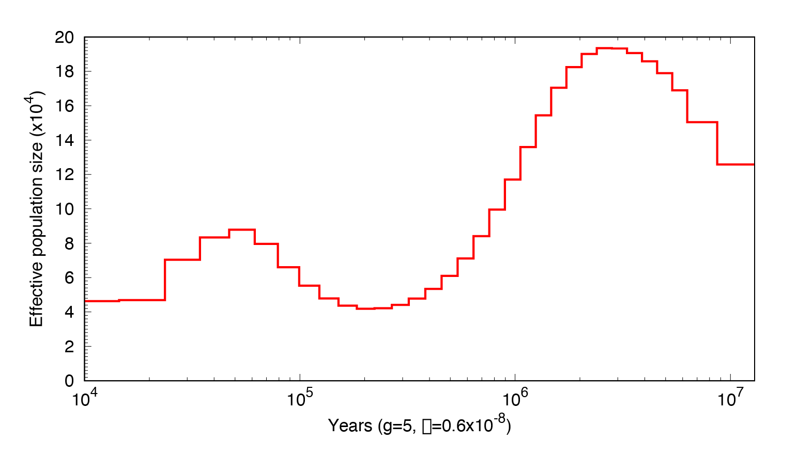
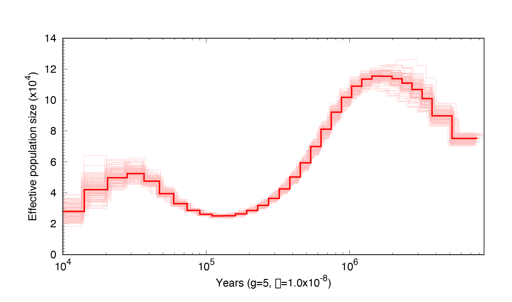
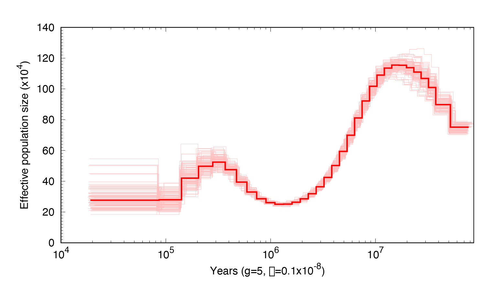
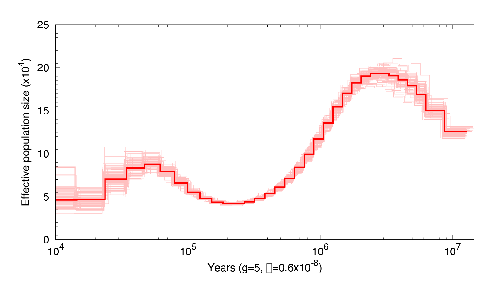
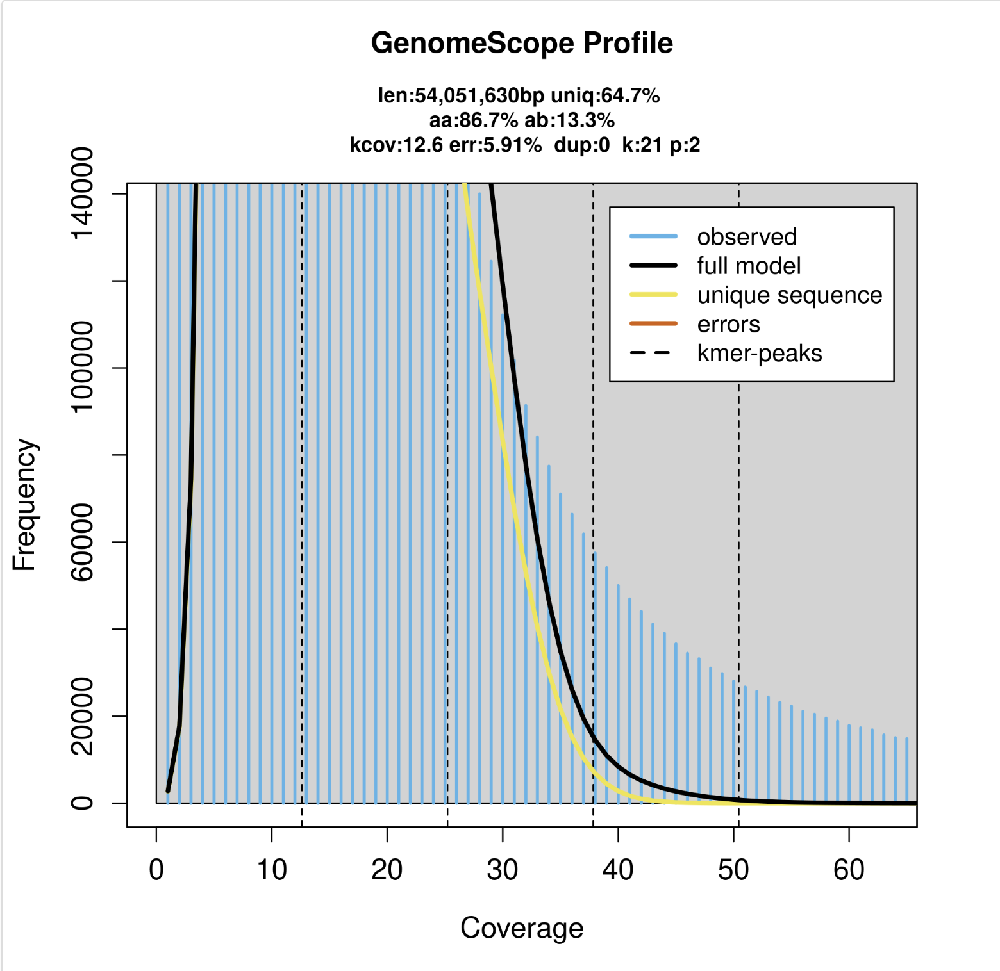
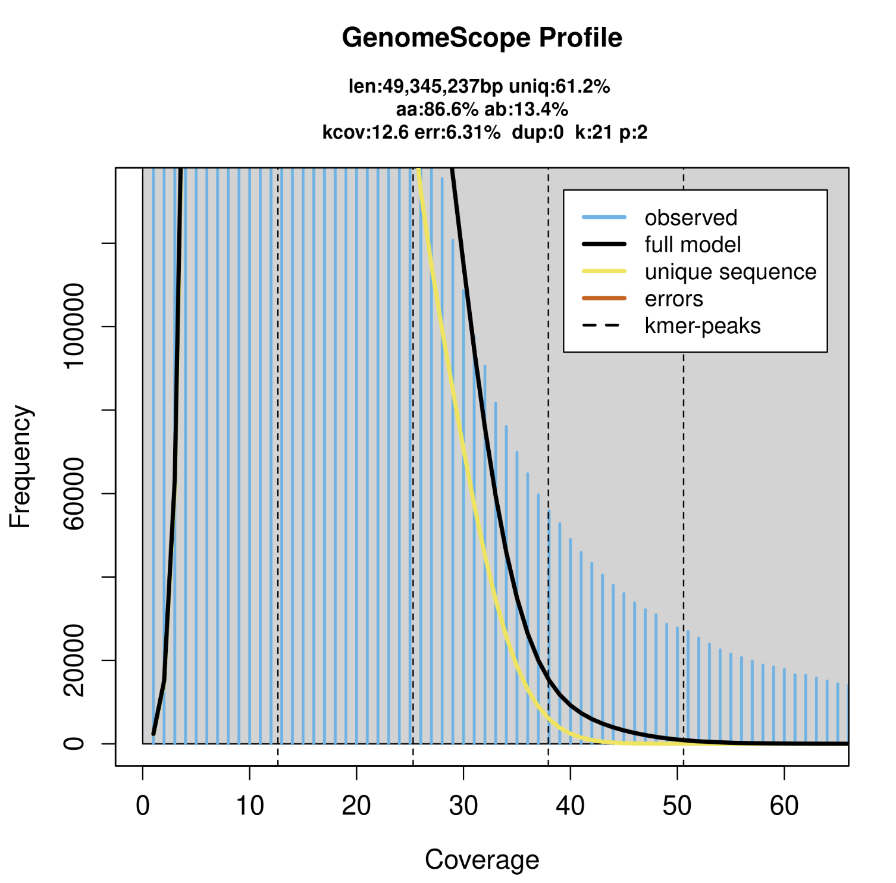

# PSMC Analysis: Inferring Population Size History using the Pairwise Sequentially Markovian Coalescent (PSMC) Model

## Download PSMC
```
git clone https://github.com/lh3/psmc.git
make; (cd utils; make)
```

## Prepare genome assembly data
I'm going to generate a highly-accurate dataset from my original fastq output by filtering to a **minimum length of 3000bp** and a **minimum quality score of Q10**. PSMC relies on accurate heterozygosity data, so we want the reads mapped to our reference to be as informative as possible with very little error.
- job name: filter_3kQ10
- job id: 48459438
- run time: 00:17:50
```
module load anaconda3/2022.05 discovery
source activate /work/gatins/hci_genome/env
cat /work/gatins/hci_genome/processing/hci_concat_noadapters.fastq | seqkit seq -m 3000 -Q 10 -j 10 > /work/gatins/hci_genome/processing/hci_filtered_3kQ10.fastq
```
Next, we can align these reads to our reference (assembly_FINAL.fasta in /processing)
```
module load minimap2/2.26
minimap2 -t 30 -ax map-ont /work/gatins/hci_genome/processing/assembly_FINAL.fasta /work/gatins/hci_genome/processing/hci_filtered_3kQ10.fastq > HCI_aligned.sam
```
Use samtools to convert sam->bam
```
module load samtools/1.19.2
samtools view -Sb -@ 30 -o HCI_aligned.bam HCI_aligned.sam
```
Sort bam file
```
samtools sort -o HCI_aligned_sorted.bam -O bam -@ 20 HCI_aligned.bam
```
Finally, index sorted bam file
```
samtools index -b -@ 20 HCI_aligned_sorted.bam
```

## Generate the whole-genome diploid consensus sequence for input
```
module load bcftools/1.21
bcftools mpileup -C50 -f assembly_no_contaminants.fasta HCI_aligned_sorted.bam | bcftools view -c --threads 10 | vcfutils.pl vcf2fq -d 50 -D 300 | gzip > diploid_HCI_50_300.fq.gz
```
- -d sets minimum read depth and is recommended to be set to 1/3 of average read depth (in this case 50)
- -D sets the maximum read depth and is recommended to be set to 2x the average read depth (in this case 300)

This script was designed to take a BAM and a reference assembly to create a VCF with genotype likelihoods for a diploid individual --> consensus call --> translate VCF to FASTQ --> gzip.

It seems that this pipeline (specifically vcfutils.pl) has been deprecated and people have recently switched over to using *samtools consensus* to get a .fq.gz consensus sequence for the PSMC analysis. Let's try it:

working in /work/gatins/hci_genome/PSMC/final_assembly_psmc
```
samtools consensus --ambig -f fastq -d 50 HCI_aligned_sorted.bam -o consensus.fq
```
now gzip
```
gzip consensus.fq
```
output:
```
consensus.fq.gz
```

## Run PSMC
First, convert diploid FASTQ into a psmcfa file:
```
/work/gatins/hci_genome/PSMC/psmc/utils/fq2psmcfa -q20 consensus.fq.gz > diploid_HCI.psmcfa
```
Now, run PSMC:
```
/work/gatins/hci_genome/PSMC/psmc/psmc -N30 -t30 -r5 -p "4+30*2+4+6+10" -o diploid_HCI_final.psmc diploid_HCI.psmcfa
```
PSMC parameters:
- p STR pattern of parameters [4+5*3+4]
- t FLOAT maximum 2N0 coalescent time [15]
- N INT maximum number of iterations [30]
- r FLOAT initial theta/rho ratio [4]
- o FILE output file [stdout]

I'm going to plot with a few different mutation rates: [1e-08, 1e-09](https://www.sciencedirect.com/science/article/pii/S0169534703000181?via%3Dihub), and [5.97e-09](https://www.nature.com/articles/s41586-023-05752-y) with a generation time of 5 years.
```
module load gnuplot/5.2.7
/work/gatins/hci_genome/PSMC/psmc/utils/psmc_plot.pl -u 1e-08 -g 5 HCI_t30r5_plot_u1-8g5 diploid_HCI_final.psmc
/work/gatins/hci_genome/PSMC/psmc/utils/psmc_plot.pl -u 1e-09 -g 5 HCI_t30r5_plot_u1-9g5 diploid_HCI_final.psmc
/work/gatins/hci_genome/PSMC/psmc/utils/psmc_plot.pl -u 5.97e-09 -g 5 HCI_t30r5_plot_u597-9g5 diploid_HCI_final.psmc
```
Output:
```
HCI_t30r5_plot_u1-8g5.eps  HCI_t30r5_plot_u1-8g5.par HCI_t30r5_plot_u1-9g5.eps HCI_t30r5_plot_u1-9g5.par HCI_t30r5_plot_u597-9g5.eps HCI_t30r5_plot_u597-9g5.par
```
Download files to computer and visualize:

mutation rate = 5.97e-09


# Bootstrapping
Follow all same steps as above and use your .psmc file for bootstrapping.

Use the splitfa command to split long chromosome sequences found in diploid_HCI.psmcfa file to shorter segments for bootstrapping.
```
/work/gatins/hci_genome/PSMC/psmc/utils/splitfa diploid_HCI.psmcfa > diploid_HCI_split.psmcfa
```
Once you have your diploid_split.psmcfa file you will need to copy this file into 100 independent files. I personally like to do this in a separate directory, so mkdir bootstrapping. Now, copy (or move) diploid_HCI_split.psmcfa and your original psmc run outfile into your new bootstrap directory. The psmc file will be used after you run the bootstrap to concatenate with the other output files.
```
mkdir bootstrap
cp diploid_HCI_split.psmcfa bootstrap
cp diploid_HCI_final.psmc bootstrap
```
Split into 100 separate files
```
echo split_HCI_{001..100}.psmcfa| xargs -n 1 cp diploid_HCI_split.psmcfa
```

Run a SLURM array! This will allow all 100 replicate jobs to be run in parallel.
```
#!/bin/bash
#SBATCH -J psmc_array			    # Job name
#SBATCH -p short                            # Partition
#SBATCH -N 1                                # Number of nodes
#SBATCH -n 2                                # Number of tasks/threads
#SBATCH -o array_%A_%a.out    		    # Name of stdout output file
#SBATCH -e array_%A_%a.err    		    # Name of stdout output file
#SBATCH --array=1-100			    # Array index
#SBATCH --mem=6000MB 			    # Memory to be allocated PER NODE
#SBATCH --mail-user=hughes.annab@northeastern.edu  # Email
#SBATCH --mail-type=END                     # Email notification at job completion
#SBATCH --time=48:00:00                     # Maximum run time

echo "My SLURM_ARRAY_TASK_ID: " $SLURM_ARRAY_TASK_ID
#
# ----------------Your Commands------------------- #
#
echo "This job in the array has:"
echo "- SLURM_JOB_ID=${SLURM_JOB_ID}"
echo "- SLURM_ARRAY_TASK_ID=${SLURM_ARRAY_TASK_ID}"

# select our filename
N=${SLURM_ARRAY_TASK_ID}
# Comment one of the following two lines, depending on if the file names have leading zeros
#FILENAME=run-${N}.inp # without leading zeros
 FILENAME=split_HCI_$(printf "%03d" ${N}).psmcfa # with leading zeros
# adjust "%03d" to as many digits as are in the numeric part of the file name
echo "My input file is ${FILENAME}"

#
echo $P
#
/work/gatins/hci_genome/PSMC/psmc/psmc -N30 -t30 -r5 -b -p "4+30*2+4+6+10" -o /work/gatins/hci_genome/PSMC/final_assembly_psmc/bootstrap/${FILENAME}.psmc /work/gatins/hci_genome/PSMC/final_assembly_psmc/bootstrap/${FILENAME}
#

echo "Job finished" `date`
echo "My input file is ${FILENAME}"
```
Concatenate all PSMC files
```
cat *.psmc > HCI_combined.psmc
```
Plot PSMC results same as above using concatenated PSMC file:
```
module load gnuplot/5.2.7
/work/gatins/hci_genome/PSMC/psmc/utils/psmc_plot.pl -u 1e-08 -g 5 HCI_t30r5_plot_u1-8g5_boot HCI_combined.psmc
/work/gatins/hci_genome/PSMC/psmc/utils/psmc_plot.pl -u 1e-09 -g 5 HCI_t30r5_plot_u1-9g5_boot HCI_combined.psmc
/work/gatins/hci_genome/PSMC/psmc/utils/psmc_plot.pl -u 5.97e-09 -g 5 HCI_t30r5_plot_u597-9g5 HCI_combined.psmc
```
mutation rate = 10^-8


mutation rate = 10^-9


mutation rate = 5.97x10^-9


## Using Illumina data
### Run Jellyfish to get coverage information

```
module load anaconda3/2024.06
source activate /projects/gatins/programs_explorer/jellyfish_2.2
jellyfish count -m 21 -s 700000000 -t 10 -C <(zcat ../HCI_CUR_092401_merged.1.142bp_3prime_val_1.fq.gz) -o HCI_CUR_092401_merged.1.142bp_3prime_val_1_21mer_output
jellyfish count -m 21 -s 700000000 -t 10 -C <(zcat ../HCI_CUR_092401_merged.2.142bp_3prime_val_2.fq.gz) -o HCI_CUR_092401_merged.2.142bp_3prime_val_2_21mer_output
```
```
jellyfish histo HCI_CUR_092401_merged.1.142bp_3prime_val_1_21mer_output > HCI_CUR_092401_merged.1.histo
jellyfish histo HCI_CUR_092401_merged.2.142bp_3prime_val_2_21mer_output > HCI_CUR_092401_merged.2.histo
```



I don't know why it is cut off like that... but seems like our coverage is between 10-15x.

Now, let's prepare the genome assembly for mapping.
*Started working on the new Explorer cluster, so my new working path has changed to start with /projects instead of /work*
```
module load bwa/0.7.18
bwa index /projects/gatins/hci_genome/processing/assembly_FINAL.fasta
```
Now map the illumina data onto the reference
```
bwa mem -O 5 -B 3 -a -M /projects/gatins/hci_genome/processing/assembly_FINAL.fasta /projects/gatins/hci_genome/illumina/clean/trimgalore_hard/HCI_CUR_092401_merged.1.142bp_3prime_val_1.fq.gz /projects/gatins/hci_genome/illumina/clean/trimgalore_hard/HCI_CUR_092401_merged.2.142bp_3prime_val_2.fq.gz > /projects/gatins/hci_genome/illumina/clean/trimgalore_hard/mapped/HCI_CUR_092401_ill_aligned.sam
```
and convert sam to bam
```
module load samtools/1.21
samtools view -Sb -@ 30 -O BAM -o /projects/gatins/hci_genome/PSMC/illumina/HCI_CUR_092401_ill_aligned.bam /projects/gatins/hci_genome/illumina/clean/trimgalore_hard/mapped/HCI_CUR_092401_ill_aligned.sam
```
and sort and index the bam file
```
samtools sort -o HCI_ill_aligned_sorted.bam -O bam -@ 20 HCI_CUR_092401_ill_aligned.bam
samtools index -b -@ 20 HCI_ill_aligned_sorted.bam
```
Samtools consensus with a min read depth of 5
```
samtools consensus --ambig -f fastq -d 5 HCI_ill_aligned_sorted.bam -o consensus.fq
gzip consensus.fq
```
## Run PSMC
First, convert diploid FASTQ into a psmcfa file:
```
/projects/gatins/hci_genome/PSMC/psmc/utils/fq2psmcfa -q20 consensus.fq.gz > diploid_HCI_ill.psmcfa
```
Now, run PSMC:
```
/projects/gatins/hci_genome/PSMC/psmc/psmc -N30 -t30 -r5 -p "4+30*2+4+6+10" -o diploid_HCI_ill.psmc diploid_HCI_ill.psmcfa
```
PSMC parameters:
- p STR pattern of parameters [4+5*3+4]
- t FLOAT maximum 2N0 coalescent time [15]
- N INT maximum number of iterations [30]
- r FLOAT initial theta/rho ratio [4]
- o FILE output file [stdout]

Now plot!
```
module load gnuplot/5.2.7
/projects/gatins/hci_genome/PSMC/psmc/utils/psmc_plot.pl -u 5.97e-09 -g 5 HCI_t30r5_plot_u597-9g5 diploid_HCI_ill.psmc
```


The peak in recent history looks really weird... I'm going to try out some different time intervals to see if this is an artefact (idea based on [this paper](https://www.cell.com/current-biology/fulltext/S0960-9822(24)01239-9)!). 
