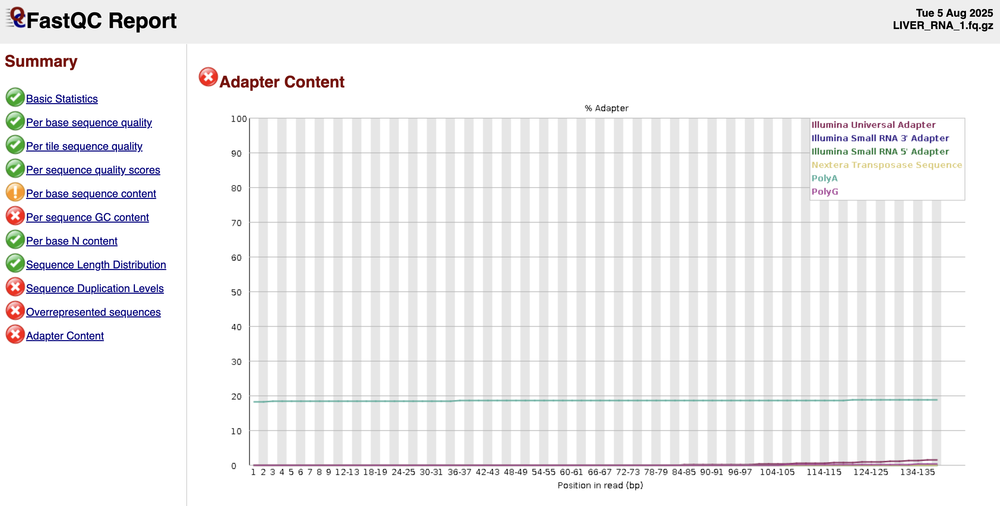

# Processing RNAseq data from Novogene

I think Novogene already performed filtering... here are the steps they list in their filtering process:

(1) Remove reads containing adapters.

(2) Remove reads containing N > 10% (N represents the base cannot be determined).

(3) Remove reads containing low quality (Qscore<= 5) base which is over 50% of the total base.

I checked a couple of samples with fastqc and it seems like the adapters are gone but they still have PolyA contamination?


I'm going to use cutadapt to try and remove this. First, I need to create a conda environment for cutadapt:
```
# Create and activate conda env for cutadapt
conda create --prefix=/projects/gatins/programs_explorer/cutadapt python=3.13.5 anaconda
source activate /projects/gatins/programs_explorer/cutadapt

# Install cutadapt
pip install cutadapt
```

Now, let's run it. This took ~35 mins with 1 core:
```
# move to wd
cd /projects/gatins/hci_genome/rnaseq/fastqs

# make 'files_all'
ls *.fq.gz > files_all
sed -i -e 's/.fq.gz//g' files_all

# activate conda env
module load anaconda3/2024.06
source activate /projects/gatins/programs_explorer/cutadapt

# run cutadapt
for i in `cat files_all`;
  do cutadapt --poly-a -o ${i}_polyAremoved.fq.gz ${i}.fq.gz;
  done
```

Next, I'm going to trim the ends with trimgalore:
```
cd /projects/gatins/hci_genome/rnaseq/fastqs

# activate conda env
module load anaconda3/2024.06
source activate /projects/gatins/programs/trimgalore_ex

# make a list of all file names without extensions
ls *_1.fq.gz > files
sed -i -e 's/_1.fq.gz//g' files

# hard trim
for i in `cat files`;
  do trim_galore --fastqc --hardtrim3 142 -o /projects/gatins/hci_genome/rnaseq/fastqs/trimmed --paired --cores 2 ${i}_1_polyAremoved.fq.gz ${i}_2_polyAremoved.fq.gz;
  done

# remove remnant adapters and quality/length trim
for i in `cat files`;
  do trim_galore --fastqc -o /projects/gatins/hci_genome/rnaseq/fastqs/trimmed --paired --cores 2 ${i}_1_polyAremoved.fq.gz ${i}_2_polyAremoved.fq.gz;
  done
```

FastQC all files:
```
pwd
/projects/gatins/hci_genome/rnaseq/fastqs/trimmed

# name all files
ls *.fq.gz > all_trimmed

# load fastqc
module load fastqc/0.12.1

# run fastqc
for i in `cat all_trimmed`;
  do fastqc ${i} -o /projects/gatins/hci_genome/rnaseq/fastqs/fastqc/trimmed;
  done
```

## Mapping RNAseq data to reference genome
Index the genome -- total time = 00:04:50
```
cd /projects/gatins/hci_genome/rnaseq
hisat2-build -p 20 /projects/gatins/hci_genome/processing/assembly_FINAL.fasta.masked HCI_masked
```

Map
```
pwd
/projects/gatins/hci_genome/rnaseq

# -x indicates the reference genome index. hisat2 looks for the specified index first in the current directory, then in the directory specified in the HISAT2_INDEXES environment variable.
export HISAT2_INDEXES=/projects/gatins/hci_genome/rnaseq

# map to genome and create SAM file
cd /projects/gatins/hci_genome/rnaseq/fastqs/trimmed
for i in `cat files`; do hisat2 -x HCI_masked -1 ${i}_1_polyAremoved.142bp_3prime.fq.gz -2 ${i}_2_polyAremoved.142bp_3prime.fq.gz -S $i.sam; done

# load modules
module load samtools/1.21

# convert SAM to BAM
for i in `cat files`; do samtools view -u $i.sam | samtools sort -o $i.bam; done

# merge all sample BAM files
samtools merge -@ 32 hci_all_trimmed_rnaseq.bam ./*bam
```
Mapping has not improved following trimming steps. I think this is because there are so many short sequences (for example, here are the errors I've gotten only when mapping the trimmed reads):
```
Warning: skipping mate #1 of read 'LH00328:636:22V3VWLT4:8:2498:39476:29417 1:N:0:TAATGCCGAC+AGCGTTCTTG' because it was < 2 characters long
Warning: skipping mate #2 of read 'LH00328:636:22V3VWLT4:8:2498:7626:29431 2:N:0:TAATGCCGAC+AGCGTTCTTG' because length (0) <= # seed mismatches (0)
Warning: skipping mate #2 of read 'LH00328:636:22V3VWLT4:8:2498:7626:29431 2:N:0:TAATGCCGAC+AGCGTTCTTG' because it was < 2 characters long
Warning: skipping mate #1 of read 'LH00328:636:22V3VWLT4:8:2498:8564:29431 1:N:0:TAATGCCGAC+AGCGTTCTTG' because length (0) <= # seed mismatches (0)
Warning: skipping mate #1 of read 'LH00328:636:22V3VWLT4:8:2498:8564:29431 1:N:0:TAATGCCGAC+AGCGTTCTTG' because it was < 2 characters long
Warning: skipping mate #2 of read 'LH00328:636:22V3VWLT4:8:2498:20602:29431 2:N:0:TAATGCCGAC+AGCGTTCTTG' because length (0) <= # seed mismatches (0)
Warning: skipping mate #2 of read 'LH00328:636:22V3VWLT4:8:2498:20602:29431 2:N:0:TAATGCCGAC+AGCGTTCTTG' because it was < 2 characters long
Warning: skipping mate #2 of read 'LH00328:636:22V3VWLT4:8:2498:22722:29431 2:N:0:TAATGCCGAC+AGCGTTCTTG' because length (0) <= # seed mismatches (0)
Warning: skipping mate #2 of read 'LH00328:636:22V3VWLT4:8:2498:22722:29431 2:N:0:TAATGCCGAC+AGCGTTCTTG' because it was < 2 characters long
Warning: skipping mate #2 of read 'LH00328:636:22V3VWLT4:8:2498:8621:29417 2:N:0:TAATGCCGAC+AGCGTTCTTG' because it was < 2 characters long
Warning: skipping mate #1 of read 'LH00328:636:22V3VWLT4:8:2498:41846:29431 1:N:0:TAATGCCGAC+AGCGTTCTTG' because length (0) <= # seed mismatches (0)
```
Let's try using TrimGalore to remove short reads. Here is a blurb from there manual:
>## Paired-End Data
>Note that it is not recommended to remove too-short sequences if the analysed FastQ file is one of a pair of paired-end files, since this confuses the sequence-by-sequence order of paired-end reads which is again required by many aligners. For paired-end files, Trim Galore! has an option --paired which runs a paired-end validation on both trimmed _1 and _2 FastQ files once the trimming has completed. This step removes entire read pairs if at least one of the two sequences became shorter than a certain threshold. If only one of the two reads is longer than the set threshold, e.g. when one read has very poor qualities throughout, this singleton read can be written out to unpaired files (see option retain_unpaired) which may be aligned in a single-end manner.

```
# activate conda env
module load anaconda3/2024.06
source activate /projects/gatins/programs/trimgalore_ex

# remove sequences shorter than 20 bp (default) -- testing on brain sample
trim_galore --length 20 --paired --cores 5 \
-o /projects/gatins/hci_genome/rnaseq/fastqs/trimmed/trimmed_length \
BRAIN_RNA_1_polyAremoved.142bp_3prime.fq.gz BRAIN_RNA_2_polyAremoved.142bp_3prime.fq.gz
```

Now, rerunning HISAT2 interactively to see if there is a difference in mapping success
```
hisat2 -x HCI_masked -1 BRAIN_RNA_1_polyAremoved.142bp_3prime_val_1.fq.gz -2 BRAIN_RNA_2_polyAremoved.142bp_3prime_val_2.fq.gz -S brain.sam -p 10
```
Mapping increased from 86.35% to 89.85%! Trying on the fin now

```
# activate conda env
module load anaconda3/2024.06
source activate /projects/gatins/programs/trimgalore_ex

# remove sequences shorter than 20 bp (default) -- testing on fin sample
trim_galore --length 20 --paired --cores 5 \
-o /projects/gatins/hci_genome/rnaseq/fastqs/trimmed/trimmed_length \
FIN_RNA_1_polyAremoved.142bp_3prime.fq.gz FIN_RNA_2_polyAremoved.142bp_3prime.fq.gz
```
Yeah, over 47% of reads were removed for being too short and this is one of the ones that had very low mapping success. Let's run HISAT2 now
```
hisat2 -x HCI_masked -1 FIN_RNA_1_polyAremoved.142bp_3prime_val_1.fq.gz -2 FIN_RNA_2_polyAremoved.142bp_3prime_val_2.fq.gz -S fin.sam -p 10
```
YES! Alignment rate increased from 39.21% to 82.05%! The length was definitely the problem here

I'm going to test one more thing and that's having not completed a hard trim on the 3' end of the sequence. Let's run TrimGalore on one of the .fq.gz sample pairs where we only removed PolyA contamination (FIN):
```
pwd
/projects/gatins/hci_genome/rnaseq/fastqs

# activate conda env
module load anaconda3/2024.06
source activate /projects/gatins/programs/trimgalore_ex

# remove sequences shorter than 20 bp (default) -- testing on fin sample pre-hard trim
trim_galore --length 20 --paired --cores 5 \
-o /projects/gatins/hci_genome/rnaseq/fastqs/trimmed/trimmed_length \
FIN_RNA_1_polyAremoved.fq.gz FIN_RNA_2_polyAremoved.fq.gz
```
```
hisat2 -x HCI_masked -1 FIN_RNA_1_polyAremoved_val_1.fq.gz -2 FIN_RNA_2_polyAremoved_val_2.fq.gz -S fin_polyAonly.sam -p 10
```
This resulted in alignment of 82.18%. I think I'm going to move forward with the following steps for each sample:
[1] Remove Poly-A contamination with cutadapt (done!)
[2] Filter sequences for remnant adapters, quality, and a minimum length cutoff of 20 bp with TrimGalore

Going to delete my first pass at trimmed sequences and redo it this way.
```
rm -r /projects/gatins/hci_genome/rnaseq/fastqs/trimmed
```

```
cd /projects/gatins/hci_genome/rnaseq/fastqs

# activate conda env
module load anaconda3/2024.06
source activate /projects/gatins/programs/trimgalore_ex

# make a list of all file names without extensions
ls *_1.fq.gz > files
sed -i -e 's/_1.fq.gz//g' files

# remove remnant adapters and quality/length trim
for i in `cat files`;
  do trim_galore --fastqc -o /projects/gatins/hci_genome/rnaseq/fastqs/trimmed --length 20 --paired --cores 2 ${i}_1_polyAremoved.fq.gz ${i}_2_polyAremoved.fq.gz;
  done
```
Now, remap
```
pwd
/projects/gatins/hci_genome/rnaseq

# -x indicates the reference genome index. hisat2 looks for the specified index first in the current directory, then in the directory specified in the HISAT2_INDEXES environment variable.
export HISAT2_INDEXES=/projects/gatins/hci_genome/rnaseq

# map to genome and create SAM file
cd /projects/gatins/hci_genome/rnaseq/fastqs/trimmed
for i in `cat files`; do hisat2 -x HCI_masked -1 ${i}_1_polyAremoved_val_1.fq.gz -2 ${i}_2_polyAremoved_val_2.fq.gz -S $i.sam -p 20; done
```
```
# load modules
module load samtools/1.21

# convert SAM to BAM
for i in `cat files`; do samtools view -u $i.sam | samtools sort -o $i.bam; done

# merge all sample BAM files
samtools merge -@ 32 hci_all_trimmed_rnaseq.bam ./*bam
```

I'm getting really low alignment rates for some of the samples... here are the outputs:
BRAIN: 89.75%
FIN: 82.18%
GILL: 39.56%
HEART: 58.84%
LIVER: 57.82%
MUSCLE: 89.88%

The brain, fin, and muscle are fine, but I don't understand why the others are so low. Let's take a look at them using DIAMOND and see if they contain contaminated reads.

First, let's make a DIAMOND database using uniprot data (this is following the same steps I took to decontaminate the reference genome assembly. I accidentally deleted these files because they were quite large so we need to remake them)
```
pwd
/projects/gatins/hci_genome/processing/diamond

# download DIAMOND
wget http://github.com/bbuchfink/diamond/releases/download/v2.1.13/diamond-linux64.tar.gz
tar xzf diamond-linux64.tar.gz

# download Uniprot Reference Proteomes
wget https://ftp.uniprot.org/pub/databases/uniprot/current_release/knowledgebase/reference_proteomes/Reference_Proteomes_2025_03.tar.gz

# extract .tar.gz file
tar xf Reference_Proteomes_2025_03.tar.gz

# create new file
touch reference_proteomes.fasta.gz

# fill new file with all .fasta.gz files downloaded with initial wget
find . -mindepth 2 | grep "fasta.gz" | grep -v 'DNA' | grep -v 'additional' | xargs cat >> reference_proteomes.fasta.gz

# build taxonomic ID map using taxid numbers in files
echo -e "accession\taccession.version\ttaxid\tgi" > reference_proteomes.taxid_map
zcat */*/*.idmapping.gz | grep "NCBI_TaxID" | awk '{print $1 "\t" $1 "\t" $3 "\t" 0}' >> reference_proteomes.taxid_map

# NCBI updated some of their classifications (i.e. "superkingdom" is no longer used), but diamond does not recognize the replacements (domain, acellular root, cellular root, realm) as taxonomic ranks. We need to replace them in the original nodes.dmp file downloaded with the rest of the taxonomic information in the taxdump directory
sed -i 's/\tdomain\t/\tsuperkingdom\t/g' nodes.dmp
sed -i 's/\tacellular root\t/\tsuperkingdom\t/g' nodes.dmp
sed -i 's/\tcellular root\t/\tsuperkingdom\t/g' nodes.dmp
sed -i 's/\trealm\t/\tclade\t/g' nodes.dmp

# make database with DIAMOND
./diamond makedb -p 10 --in reference_proteomes.fasta.gz --taxonmap reference_proteomes.taxid_map --taxonnodes ../taxdump/nodes.dmp -d reference_proteomes.dmnd
```

Now, let's use DIAMOND to blast our RNAseq data against this database
```
pwd
/projects/gatins/hci_genome/processing/diamond/rnaseq

# running a search in blastx mode
# GILL
../diamond blastx -d reference_proteomes.dmnd -q /projects/gatins/hci_genome/rnaseq/fastqs/trimmed/GILL_RNA_1_polyAremoved_val_1.fq.gz -o gill_1_matches.tsv
../diamond blastx -d reference_proteomes.dmnd -q /projects/gatins/hci_genome/rnaseq/fastqs/trimmed/GILL_RNA_2_polyAremoved_val_2.fq.gz -o gill_2_matches.tsv

# HEART
../diamond blastx -d reference_proteomes.dmnd -q /projects/gatins/hci_genome/rnaseq/fastqs/trimmed/HEART_mixed_1_polyAremoved_val_1.fq.gz -o heart_1_matches.tsv
../diamond blastx -d reference_proteomes.dmnd -q /projects/gatins/hci_genome/rnaseq/fastqs/trimmed/HEART_mixed_2_polyAremoved_val_2.fq.gz -o heart_2_matches.tsv

# LIVER
../diamond blastx -d reference_proteomes.dmnd -q /projects/gatins/hci_genome/rnaseq/fastqs/trimmed/LIVER_RNA_1_polyAremoved_val_1.fq.gz -o liver_1_matches.tsv
../diamond blastx -d reference_proteomes.dmnd -q /projects/gatins/hci_genome/rnaseq/fastqs/trimmed/LIVER_RNA_2_polyAremoved_val_2.fq.gz -o liver_2_matches.tsv
```

