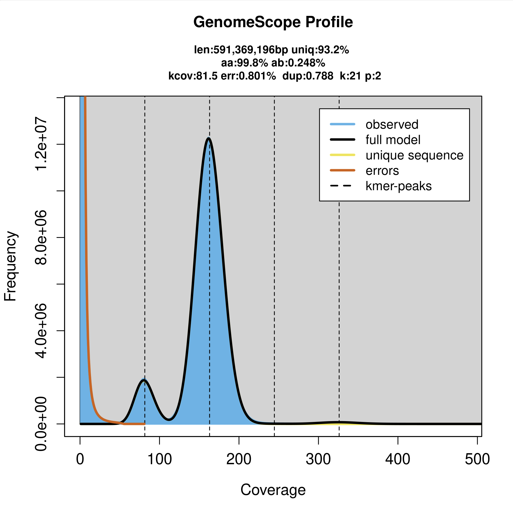

This markdown contains everything I tried in the process of creating [my final genome assembly pipeline for the queen angelfish](https://github.com/amhughes8/Hciliaris_Genome/blob/main/Holacanthus-ciliaris-Genome-Assembly.md).

# Get basecalled data from Miten
```
wget https://s3.amazonaws.com/gtl-public-data/miten/remy/03_24_25_R10_HCI_CUR_092401_GENOME.5mC_5hmC.sup.dorado.0.9.1.bam hughes.annab@xfer.discovery.neu.edu:/work/gatins/hci_genome/bams
wget https://s3.amazonaws.com/gtl-public-data/miten/remy/03_24_25_R10_HCI_CUR_092401_GENOME_SS.5mC_5hmC.sup.dorado.0.9.1.bam hughes.annab@xfer.discovery.neu.edu:/work/gatins/hci_genome/bams
```
let's store this data in an untouched 'bams' directory and also make a copy to work with in a 'processing' directory
```
cp /work/gatins/hci_genome/bams/03_24_25_R10_HCI_CUR_092401_GENOME.5mC_5hmC.sup.dorado.0.9.1.bam /work/gatins/hci_genome/processing
cp /work/gatins/hci_genome/bams/03_24_25_R10_HCI_CUR_092401_GENOME_SS.5mC_5hmC.sup.dorado.0.9.1.bam /work/gatins/hci_genome/processing
```
compressing original files to save storage space
- job name: tar_gzip_bams
- job id: 48012219
- run time: 02:03:15
```
tar -zcvf /work/gatins/hci_genome/HCI_CUR_092401_ONT_bams.gz /work/gatins/hci_genome/bams
```
renaming the bams I will work with in the /processing directory for simplicity
```
mv 03_24_25_R10_HCI_CUR_092401_GENOME.5mC_5hmC.sup.dorado.0.9.1.bam fc1.bam
mv 03_24_25_R10_HCI_CUR_092401_GENOME_SS.5mC_5hmC.sup.dorado.0.9.1.bam fc2_SS.bam
```

# Use samtools to convert bam --> fastq
- job name: bam2fastq
- job id:48007076
- run time: 01:15:41
```
module load samtools/1.9
samtools bam2fq fc1.bam > hci1.fastq
samtools bam2fq fc2_SS.bam > hci2.fastq
```

# Check stats from each fastq using [NanoStat](https://github.com/wdecoster/nanostat) OR [SeqKit](https://bioinf.shenwei.me/seqkit/usage/)
- job name: flowcell_stats
- job id: 48011288
- run time: 02:54:42
```
module load anaconda3/2022.05
source activate /work/gatins/hci_genome/env
NanoStat --fastq /work/gatins/hci_genome/processing/hci1.fastq --outdir /work/gatins/hci_genome/processing/statreports --name hci1_Nanostat_fastqreport
NanoStat --fastq /work/gatins/hci_genome/processing/hci2.fastq --outdir /work/gatins/hci_genome/processing/statreports --name hci2_Nanostat_fastqreport
```
I'm curious about the difference in outputs from NanoStat and seqkit so let's run seqkit too
- job name: stats_seqkit
- job id: 48021445
- run time: 00:07:34
```
module load anaconda3/2022.05
source activate /work/gatins/hci_genome/env
seqkit stat /work/gatins/hci_genome/processing/*.fastq
```

# Trim Adapters with [Porechop](https://github.com/rrwick/Porechop)
Porechop uses a lot of memory, so it is going to be really challenging to run on a concatenated file. I submitted a batch job on April 10 for hci1.fastq asking for 800G of memory (it is still in the queue) and I'm now interactively running Porechop on hci2.fastq with 300G of memory. **this step takes longer than 4 hours (short partition default), so make sure to indicate longer runtimes!**
```
srun --partition=short --nodes=1 --cpus-per-task=1 --mem=300G --time=48:00:00 --pty /bin/bash
porechop -i hci2.fastq -o hci2_noadapters.fastq
```
- job name: porechop1
- job id: 48049716
- run time: 20:39:38
```
module load anaconda3/2022.05
source activate /work/gatins/hci_genome/env
porechop -i /work/gatins/hci_genome/processing/hci1.fastq -o hci1_noadapters.fastq
```

# Concatenate to one big file
now that things look good after Porechop, let's concatenate before we filter and assemble
```
cat hci1_noadapters.fastq hci2_noadapters.fastq > hci_concat_noadapters.fastq
```

# Filter with SeqKit
we're filtering to a minimum sequence length of 2000 and minimum Q-score of 3 (I also allocated 10 threads to try and speed up the process). I also ran the concatenate function above with the seqkit filtering step as a batch job together:
- job name: concatenate_filter
- job id: 48175086
- run time: 00:33:29
```
module load anaconda3/2022.05 discovery
source activate /work/gatins/hci_genome/env
cat /work/gatins/hci_genome/processing/hci1_noadapters.fastq /work/gatins/hci_genome/processing/hci2_noadapters.fastq > /work/gatins/hci_genome/processing/hci_concat_noadapters.fastq
cat /work/gatins/hci_genome/processing/hci_concat_noadapters.fastq | seqkit seq -m 2000 -Q 3 -j 10 > /work/gatins/hci_genome/processing/hci_filtered_2kQ3.fastq
```
running stats on filtered output (saved output as .txt file)
```
seqkit stats hci_filtered_2kQ3.fastq -a
```

# Estimate genome size with [Jellyfish](https://github.com/gmarcais/Jellyfish) (k=21)
- job name: jellyfish
- job id: 48198203
- run time: 03:08:30
```
module load jellyfish/2.2.10
jellyfish count -m 21 -s 100M -t 10 -C -o hci_21mer_output /work/gatins/hci_genome/processing/hci_filtered_2kQ3.fastq
```
```
jellyfish histo hci_21mer_output
```
Upload this histogram file to [GenomeScope](http://genomescope.org/genomescope2.0/) to look at sequencing coverage and get a genome size estimate.
- Description: HCI_CUR_092401
- K-mer length: 21
- Ploidy: 2
- Max k-mer coverage: -1 (left at default)
- Average k-mer coverage for polyploid genome: -1 (left at default)



I ran jellyfish again with a dataset I filtered to Q5 reads (hci_filtered_2.5KQ5). 
- job name: jellyfishQ5
- job id: 48316419
- run time: 02:12:55
```
module load jellyfish/2.2.10
jellyfish count -m 21 -s 500M -t 10 -C -o hciQ5_21mer_output /work/gatins/hci_genome/processing/hci_filtered_2.5kQ5.fastq
```
```
jellyfish histo hciQ5_21mer_output
```
- Description: HCI_CUR_092401
- K-mer length: 21
- Ploidy: 2
- Max k-mer coverage: -1 (left at default)
- Average k-mer coverage for polyploid genome: -1 (left at default)


# ASSEMBLIES
## Method 1: [Flye](https://github.com/mikolmogorov/Flye)
Creating an initial assembly with the 2kQ3 filtered dataset created above. Requested 500G RAM and 32 threads:
- job name: assembly_flye
- job id: 48197184
- run time: 21:31:05
```
flye --nano-raw /work/gatins/hci_genome/processing/hci_filtered_2kQ3.fastq --threads 32 --out-dir /work/gatins/hci_genome/processing/assembly_Flye
```
### Running [BUSCO](https://busco.ezlab.org/busco_userguide.html#tips-for-running-busco)
first, find which dataset to run Busco against
```
busco --list-datasets
```
running against the **actinopterygii_odb12** dataset
- job name: busco_initial_assembly_flye
- job id: 48238947
- run time: 00:46:58
```
module load anaconda3/2022.05
source activate /work/gatins/hci_genome/busco
busco -i /work/gatins/hci_genome/processing/assembly_Flye/assembly.fasta --mode genome --lineage_dataset actinopterygii_odb12 --cpu 25 --out initial_assembly_flye_busco
```
**will repeat this same BUSCO check after each assembly trial**


|  file    | format | type | num_seqs  |  sum_len | min_len   |   avg_len  |   max_len   |    Q1   |     Q2    |     Q3 | sum_gap   |  N50 | N50_num | Q20(%) | Q30(%) | AvgQual | GC(%) | sum_n | BUSCO |
|----------|---------------|------|-----------|------------|-----------|------------|-------------|---------|-----------|--------|-----------|---------|---------|--------|--------|---------|-------|-------|------|
|assembly_Flye/assembly.fasta | FASTA |  DNA   |   624 | 594,359,000   |   283 | 952,498.4 | 23,379,083 | 3,326.5 | 9,735 | 479,921.5    |    0 | 5,707,192    |   25   |    0    |   0    |    0 | 41.39   |   0| 98.6% |


## Method 2: Flye + polish with [Medaka](https://github.com/nanoporetech/medaka) (ONT recommendation) 
### polish with Medaka
Polishing my initial Flye assembly (assembly_Flye/assembly.fasta) with Medaka. I'm not positive about the basecaller model... but got it from Dorado github. to find model list:
```
medaka tools list\_models
```
- job name: medaka_polish
- job id: 48241944
- run time: 2-00:00:00 and  it didn't finish within 48 hrs! TIMEOUT
```
medaka_consensus -i /work/gatins/hci_genome/processing/hci_concat_noadapters.fastq -d /work/gatins/hci_genome/processing/assembly_Flye/assembly.fasta -o medaka_out -t 32 -m r1041_e82_400bps_sup_v5.0.0
```
I need to try to parallellize this process a bit more because it is clearly very time intensive. [This Github issues thread](https://github.com/nanoporetech/medaka/issues/35) and the Medaka GitHub page both recommend breaking up the 3 steps of medaka_consensus (alignment, consensus, aggregation). So, let's run alignment first:
- job name: medaka_align
- job id: 48322513
- run time: 02:13:57
```
mini_align -i /work/gatins/hci_genome/processing/hci_concat_noadapters.fastq -r /work/gatins/hci_genome/processing/assembly_Flye/assembly.fasta -P -m -p medaka_align.bam -t 32
```
This resulted in a medaka_align.bam.bam file. Now running medaka inference on the .bam output:
- job name: medaka_inference
- job id: 48363197
- run time: 2-00:00:00 and  it didn't finish within 48 hrs! TIMEOUT
**if this doesn't work (/it times out and doesn't finish by the end of 48 hrs), I'll need to break this step up into smaller jobs)**
```
module load anaconda3/2022.05
source activate medaka
medaka inference /work/gatins/hci_genome/processing/medaka/medaka_align.bam.bam /work/gatins/hci_genome/processing/medaka/results --model r1041_e82_400bps_sup_v5.0.0 --threads 2
```
Okay... looks like we need to break this up by contigs. I've submitted 23 separate inference jobs focused on a segment of contigs in the assembly. Each job looks something like this:
```
cat inf20.sh

module load anaconda3/2022.05
source activate medaka
medaka inference /work/gatins/hci_genome/processing/medaka/medaka_align.bam.bam /work/gatins/hci_genome/processing/medaka/results_inference/contigs1766-1916.hdf --model r1041_e82_400bps_sup_v5.0.0 --threads 2 --region contig_1766 contig_1768 contig_1769 contig_1772 contig_1780 contig_1781 contig_1784 contig_1786 contig_1788 contig_1789 contig_1791 contig_1792 contig_1794 contig_1801 contig_1803 contig_1808 contig_1810 contig_1811 contig_1825 contig_1827 contig_1835 contig_1837 contig_1841 contig_1843 contig_1859 contig_1860 contig_1862 contig_1864 contig_1865 contig_1866 contig_1868 contig_1870 contig_1872 contig_1895 contig_1896 contig_1899 contig_1900 contig_1903 contig_1910 contig_1916
```
Now that we have all of the .hdf files from the inference step, we can collate the results with *medaka sequence* (a form of **medaka stitch**)
- job name: medaka_sequence
- job id: 48460143
- run time: 00:09:28
```
module load anaconda3/2022.05
source activate medaka
medaka sequence "/work/gatins/hci_genome/processing/medaka/results_inference/"/*.hdf /work/gatins/hci_genome/processing/assembly_Flye/assembly.fasta polished.assembly.fasta --threads 10
```

|  file    | format | type | num_seqs  |  sum_len | min_len   |   avg_len  |   max_len   |    Q1   |     Q2    |     Q3 | sum_gap   |  N50 | N50_num | Q20(%) | Q30(%) | AvgQual | GC(%) | sum_n | BUSCO |
|----------|---------------|------|-----------|------------|-----------|------------|-------------|---------|-----------|--------|-----------|---------|---------|--------|--------|---------|-------|-------|------|
polished.assembly.fasta | FASTA |  DNA  |   624 | 594,350,740  |  283 | 952,485.2 | 23,379,206 | 3,325.5 | 9,728.5 | 479,931   |   0 | 5,706,798   |    25   |    0   |    0   |     0  | 41.4  |    0 | 98.7% |

## Method 3: [Hifiasm](https://github.com/chhylp123/hifiasm)
- job name: hifiasm_assembly
- job id: 48242171
- run time: 18:00:21
```
module load anaconda3/2022.05
source activate /work/gatins/hci_genome/env
hifiasm -o assembly_hifiasm.asm --ont -t32 /work/gatins/hci_genome/processing/hci_filtered_2kQ3.fastq
```

|  file    | format | type | num_seqs  |  sum_len | min_len   |   avg_len  |   max_len   |    Q1   |     Q2    |     Q3 | sum_gap   |  N50 | N50_num | Q20(%) | Q30(%) | AvgQual | GC(%) | sum_n | BUSCO |
|----------|---------------|------|-----------|------------|-----------|------------|-------------|---------|-----------|--------|-----------|---------|---------|--------|--------|---------|-------|-------|------|
|test_hifiasm.fa | FASTA  | DNA  |      338 | 608,394,079  |  3,041 | 1,799,982.5 | 31,942,965 | 5,485 | 8,522 | 16,083   |     0 | 26,222,608   |    11   |    0   |    0    |    0 | 41.43  |    0 | 98.8% |

## Method 4: Flye with harsher filtering
Using seqkit, I refiltered with harsher criteria to try and achieve an assembly with fewer contigs.
- job name: filter_2.5kQ5
- job id: 48242201
- run time: 00:17:17
```
module load anaconda3/2022.05 discovery
source activate /work/gatins/hci_genome/env
cat /work/gatins/hci_genome/processing/hci_concat_noadapters.fastq | seqkit seq -m 2500 -Q 5 -j 10 > /work/gatins/hci_genome/processing/hci_filtered_2.5kQ5.fastq
```
Now, I will re-assemble with Flye with this new filtered data
- job name: assembly_flye_2.5kQ5
- job id: 48242538
- run time: 14:49:18
```
flye --nano-raw /work/gatins/hci_genome/processing/hci_filtered_2.5kQ5.fastq --threads 32 --out-dir /work/gatins/hci_genome/processing/assembly_Flye_2.5kQ5
```
```
seqkit stats assembly.fasta -a
```

|  file    |        format | type | num_seqs  |    sum_len | min_len   |   avg_len  |   max_len   |    Q1   |     Q2    |     Q3 | sum_gap   |     N50 | N50_num | Q20(%) | Q30(%) | AvgQual | GC(%) | sum_n | BUSCO |
|----------|---------------|------|-----------|------------|-----------|------------|-------------|---------|-----------|--------|-----------|---------|---------|--------|--------|---------|-------|-------|-------|
|assembly_Flye_2.5kQ5/assembly.fasta | FASTA |  DNA   |   442 | 594,793,216   |   290 | 1,345,686 | 23,421,175 | 5,149 | 17,279.5 | 753,846   |    0 | 9,307,034   |    21    |   0    |   0    |   0 | 41.38   |   0 | 98.7% |

## Method 5: Flye, harsher filtering, --nano-hq and --scaffold
I haven't been positive which --nano flag to use so I've used the default which is --nano-raw. I'm going to try --nano-hq mode now because it does say this is what you should use for "the most recent ONT data basecalled with Guppy5+ SUP." I'm also going to add a --scaffold flag to see what this does to my number of sequences.
- job name: assembly_flye_hq_scaff
- job id: 48323649
- run time:
```
flye --nano-hq /work/gatins/hci_genome/processing/hci_filtered_2.5kQ5.fastq --threads 32 --scaffold --out-dir /work/gatins/hci_genome/processing/assembly_Flye_hq_scaff
```
|  file    |        format | type | num_seqs  |    sum_len | min_len   |   avg_len  |   max_len   |    Q1   |     Q2    |     Q3 | sum_gap   |     N50 | N50_num | Q20(%) | Q30(%) | AvgQual | GC(%) | sum_n | BUSCO |
|----------|---------------|------|-----------|------------|-----------|------------|-------------|---------|-----------|--------|-----------|---------|---------|--------|--------|---------|-------|-------|-------|
| assembly_Flye_hq_scaff/assembly.fasta | FASTA  | DNA  |  507 | 597,798,499  | 512 | 1,179,089.7 | 25,627,744 | 5,811.5 | 18,433 | 325,102  |  0 | 11,446,352 | 18  |     0   |    0    |    0 | 41.38 | 3,800 | 98.8% |

### now let's check and make sure the adapters came off with [FCS](https://github.com/ncbi/fcs) from NCBI
```
module load singularity/3.10.3
curl -LO https://github.com/ncbi/fcs/raw/main/dist/run_fcsadaptor.sh
chmod 755 run_fcsadaptor.sh
curl https://ftp.ncbi.nlm.nih.gov/genomes/TOOLS/FCS/releases/latest/fcs-adaptor.sif -Lo fcs-adaptor.sif
```
testing on assembly #4:
```
module load singularity/3.10.3
mkdir fcs_output_2.5kQ5
./run_fcsadaptor.sh --fasta-input /work/gatins/hci_genome/processing/assembly_Flye_2.5kQ5/assembly.fasta --output-dir /work/gatins/hci_genome/processing/fcs_output_2.5kQ5 --euk --container-engine singularity --image fcs-adaptor.sif
```
Output (fcs_adaptor_report.txt):
| accession	| length	| action	| range	| name |
|-----------|---------|---------|-------|------|
|contig_1435	| 1811395	| ACTION_TRIM	| 141196..141220	| CONTAMINATION_SOURCE_TYPE_ADAPTOR:NGB00972.1:Pacific Biosciences Blunt Adapter |

I'm not sure why it detected a PacBio adapter in my assembly... Let's test it on the other assemblies. Assembly 1:
```
mkdir fcs_output_initial_assembly
./run_fcsadaptor.sh --fasta-input /work/gatins/hci_genome/processing/assembly_Flye/assembly.fasta --output-dir /work/gatins/hci_genome/processing/fcs_output_initial_assembly --euk --container-engine singularity --image fcs-adaptor.sif
```
Output (fcs_adaptor_report.txt):
| accession	| length	| action	| range	| name |
|-----------|---------|---------|-------|------|

No contamination detected here...??? Testing Hifiasm assembly now:
```
mkdir fcs_output_hifiasm
./run_fcsadaptor.sh --fasta-input test_hifiasm.fa --output-dir /work/gatins/hci_genome/processing/fcs_output_hifiasm --euk --container-engine singularity --image fcs-adaptor.sif
```
No adapter contamination detected. Going to investigate.

# Contamination Identification with [Kraken2](https://github.com/DerrickWood/kraken2/blob/master/docs/MANUAL.markdown)
First, I will create the standard Kraken2 database which contains "NCBI taxonomic information, as well as the complete genomes in RefSeq for the bacterial, archaeal, and viral domains, along with the human genome and a collection of known vectors (UniVec_Core)." 
```
/work/gatins/hci_genome/kraken2/kraken2-build --standard --threads 24 --db /work/gatins/hci_genome/processing/kraken2_standard_db --use-ftp
```
This quit after downloading taxonomic information but in the middle of downloading the archaea database. Going to try and pull everything interactively one db at a time to see if I can avoid a timeout error with ftp:
```
srun --partition=short --nodes=1 --cpus-per-task=10 --mem=50G --pty /bin/bash
/work/gatins/hci_genome/kraken2/kraken2-build --threads 6 --use-ftp --db /work/gatins/hci_genome/processing/kraken2_standard_db --download-library archaea
/work/gatins/hci_genome/kraken2/kraken2-build --threads 6 --use-ftp --db /work/gatins/hci_genome/processing/kraken2_standard_db --download-library viral
/work/gatins/hci_genome/kraken2/kraken2-build --threads 6 --use-ftp --db /work/gatins/hci_genome/processing/kraken2_standard_db --download-library bacteria
/work/gatins/hci_genome/kraken2/kraken2-build --threads 6 --use-ftp --db /work/gatins/hci_genome/processing/kraken2_standard_db --download-library plasmid
/work/gatins/hci_genome/kraken2/kraken2-build --threads 6 --use-ftp --db /work/gatins/hci_genome/processing/kraken2_standard_db --download-library human --no-mask
```
I keep receiving timeout errors `Step 1/2: Performing ftp file transfer of requested files
rsync_from_ncbi.pl: FTP connection error: Net::FTP: connect: timeout`... Not sure what to do about this but I found [this GitHub issues page](https://github.com/DerrickWood/kraken2/issues/272) where people were running into the same problem. I'm going to take the approach recommended in this thread and use a [custom-built python script](https://github.com/R-Wright-1/peptides/blob/master/download_domain.py) to pull all of the data from NCBI.

I started pulling the bacteria domain interactively and it's taking forever, so I'm submitting a batch job for the rest.
- job name: kraken2db_datapull (accidentally have it named the same as medaka_align because i never changed it in batch job oops)
- job id: 48321063
- run time: 00:43:01
```
module load python/3.8.1
conda install -c conda-forge biopython
conda install pandas
python /work/gatins/hci_genome/kraken2/download_domain.py --domain archaea --complete True --ext dna
python /work/gatins/hci_genome/kraken2/download_domain.py --domain viral --complete True --ext dna
python /work/gatins/hci_genome/kraken2/download_domain.py --domain plasmid --complete True --ext dna
python /work/gatins/hci_genome/kraken2/download_domain.py --domain vertebrate_mammalian --complete True --ext dna --human True
```

I ended up needing to pull the bacteria with a batch job too:
- job name: bacterial_data_kraken2
- job id: 48322385
- run time: 06:42:49
```
module load python/3.8.1
module load anaconda3/2022.05
source activate /work/gatins/hci_genome/env
cd /work/gatins/hci_genome/processing/kraken2_builtpython
python /work/gatins/hci_genome/kraken2/download_domain.py --domain bacteria --complete True --ext dna
```

Now that everything is downloaded into a /genomes directory in kraken2_builtpython, I need to --add-to-library:
- job name: kraken_addtolib
- job id: 48364282
- run time: 01:50:18
```
find /work/gatins/hci_genome/processing/kraken2_builtpython/genomes/ -name '*.fna' -print0 | xargs -0 -I{} -n1 -P10 /work/gatins/hci_genome/kraken2/kraken2-build --add-to-library {} --db /work/gatins/hci_genome/processing/kraken2_builtpython
```

Next, we build the Kraken2 database:
- job name: kraken_build
- job id: 48392591
- run time: 1-00:51:47
```
module load gcc/9.2.0
/work/gatins/hci_genome/kraken2/kraken2-build --db /work/gatins/hci_genome/processing/kraken2_builtpython --build --threads 6
```

You'll know the Kraken database has been built properly when you have these three files: 
- hash.k2d: Contains the minimizer to taxon mappings
- opts.k2d: Contains information about the options used to build the database
- taxo.k2d: Contains taxonomy information used to build the database

We have them! So let's go ahead and run the Hifiasm assembly against this database:
- job name: kraken_classify
- job id: 48475381
- run time: 00:02:20
```
module load gcc/9.2.0
/work/gatins/hci_genome/kraken2/kraken2 --threads 20 --db /work/gatins/hci_genome/processing/kraken2_builtpython --use-names --report kraken2_hifiasm_report /work/gatins/hci_genome/processing/hifiasm_output/hifiasm_assembly.fa
```
Now, to remove contamination, let's follow Remy's script from the *H. passer* assembly. Output files:
```
error_kraken2_classify.txt kraken2_hifiasm_report output_kraken2_classify.txt
```
We will use **output_kraken2_classify.txt** to get a list of just contigs from our output:
```
grep "ptg" /work/gatins/hci_genome/processing/outputs_errors/output_kraken2_classify.txt > kraken2_results.txt
```
Now get a list of human and unclassified contigs: By doing this, we are removing anything classified as bacteria, plasmids or viruses. We keep the unclassified because they might contain real contigs.
```
grep "unclassified\|Homo sapiens" kraken2_results.txt | cut -f2 > assembly.fasta.HsU.list
```
Using samtools, we will extract from the assembly only the contigs identified as Human or unclassified. Bacteria, viruses and plasmids will be excluded.
```
module load samtools/1.9
xargs samtools faidx /work/gatins/hci_genome/processing/hifiasm_output/hifiasm_assembly.fa  < assembly.fasta.HsU.list > assembly_no_contaminants.fasta
```
seqkit stats on assembly_no_contaminants.fasta:
|  file    |        format | type | num_seqs  |    sum_len | min_len   |   avg_len  |   max_len   |    Q1   |     Q2    |     Q3 | sum_gap   |     N50 | N50_num | Q20(%) | Q30(%) | AvgQual | GC(%) | sum_n | BUSCO |
|----------|---------------|------|-----------|------------|-----------|------------|-------------|---------|-----------|--------|-----------|---------|---------|--------|--------|---------|-------|-------|-------|
assembly_no_contaminants.fasta | FASTA  | DNA    |    292 | 607,773,636  |  3,041 | 2,081,416.6 | 31,942,965  |5,548 | 8,984.5 | 18,929.5    |    0 | 26,222,608   |    11   |    0   |    0     |   0 | 41.43   |   0 | 98.8% |

So after Kraken2, we have removed 620,443 bp which is about 0.1% of the original assembly. Let's double check and make sure we aren't removing real sequence data.

First, let's make a list of contigs in each file (pre and post contamination removal)
```
grep "ptg" /work/gatins/hci_genome/processing/hifiasm_output/hifiasm_assembly.fa > ctg_HCI.txt
grep "ptg" assembly_no_contaminants.fasta > ctg_HCI_no_contaminants.txt
```
Let's compare these files
```
diff ctg_HCI.txt ctg_HCI_no_contaminants.txt > ctg_removed.txt
```
```
head ctg_removed.txt
```
```
30,32d29
< >ptg000030l
< >ptg000031l
< >ptg000032l
52d48
< >ptg000052l
56d51
< >ptg000056l
63d57
< >ptg000063l
```
Get a list with only the contig names
```
grep "ptg" ctg_removed.txt > ctg_removed_list.txt
```
we still end up with the < > symbols before each line so use a text editor (e.g, vim or nano) to remove these manually (I'm sure there are commands to dothis but I have very few contigs so this was faster.
```
cat ctg_removed_list.txt
```
```
< >ptg000030l
< >ptg000031l
< >ptg000032l
< >ptg000052l
< >ptg000056l
< >ptg000063l
< >ptg000072l
< >ptg000077l
< >ptg000101l
< >ptg000102l
< >ptg000103l
< >ptg000108l
< >ptg000110l
< >ptg000113l
< >ptg000115l
< >ptg000120l
< >ptg000124l
< >ptg000136l
< >ptg000141l
< >ptg000153l
< >ptg000155l
< >ptg000165l
< >ptg000167l
< >ptg000179l
< >ptg000181l
< >ptg000186l
< >ptg000204l
< >ptg000207l
< >ptg000210l
< >ptg000215l
< >ptg000218l
< >ptg000220l
< >ptg000224l
< >ptg000244l
< >ptg000279l
< >ptg000285l
< >ptg000286l
< >ptg000292l
< >ptg000296l
< >ptg000302l
< >ptg000309l
< >ptg000313l
< >ptg000316l
< >ptg000322l
< >ptg000326l
< >ptg000328l
```
Now we can use samtools to extract from the assembly only the contigs with sequences from our ctg_removed_list.txt and BLAST it
```
xargs samtools faidx /work/gatins/hci_genome/processing/hifiasm_output/hifiasm_assembly.fa  < ctg_removed_list.txt > HCI_contaminants.fasta
```
It seems like the mitochondrial sequences that I left in are messing this process up. I'm going to remove the mtDNA and redo this step.

## Rebuilding Kraken database with fish sequences as "positive controls"
I copied over the library I created my first Kraken database with and am now adding three fish genomes to have positive controls. I'm adding sequences from Atlantic cod (*Gadus morhua*), bicolor damselfish (*Stegastes partitus*), and pinfish (*Lagodon rhomboides*). 
```
cd /work/gatins/hci_genome/processing/krakendb_fish
wget https://ftp.ncbi.nlm.nih.gov/genomes/all/GCF/902/167/405/GCF_902167405.1_gadMor3.0/GCF_902167405.1_gadMor3.0_genomic.fna.gz
wget https://ftp.ncbi.nlm.nih.gov/genomes/all/GCF/000/690/725/GCF_000690725.1_Stegastes_partitus-1.0.2/GCF_000690725.1_Stegastes_partitus-1.0.2_genomic.fna.gz
wget https://ftp.ncbi.nlm.nih.gov/genomes/all/GCA/039/737/535/GCA_039737535.1_Lrho_1.0/GCA_039737535.1_Lrho_1.0_genomic.fna.gz
```
Now, let's add them to our new library
```
# Pinfish
/work/gatins/hci_genome/kraken2/kraken2-build --add-to-library GCA_039737535.1_Lrho_1.0_genomic.fna.gz --db /work/gatins/hci_genome/processing/krakendb_fish
# Atlantic cod
/work/gatins/hci_genome/kraken2/kraken2-build --add-to-library GCF_902167405.1_gadMor3.0_genomic.fna.gz --db /work/gatins/hci_genome/processing/krakendb_fish
# Bicolor damselfish
/work/gatins/hci_genome/kraken2/kraken2-build --add-to-library GCF_000690725.1_Stegastes_partitus-1.0.2_genomic.fna.gz --db /work/gatins/hci_genome/processing/krakendb_fish
```

# Generating plots with Blobtools
while i continue to troubleshoot Kraken, I will test on the hifiasm assembly
```
blobtools create --fasta /work/gatins/hci_genome/processing/test_hifiasm.fa BlobDir
```
