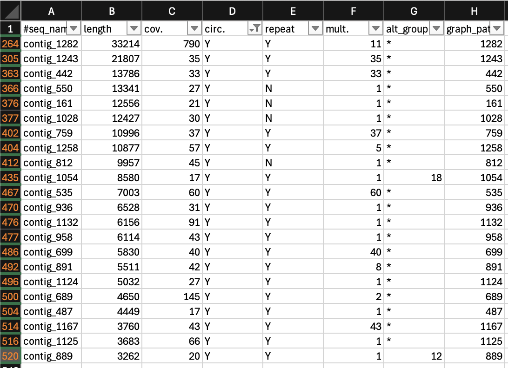
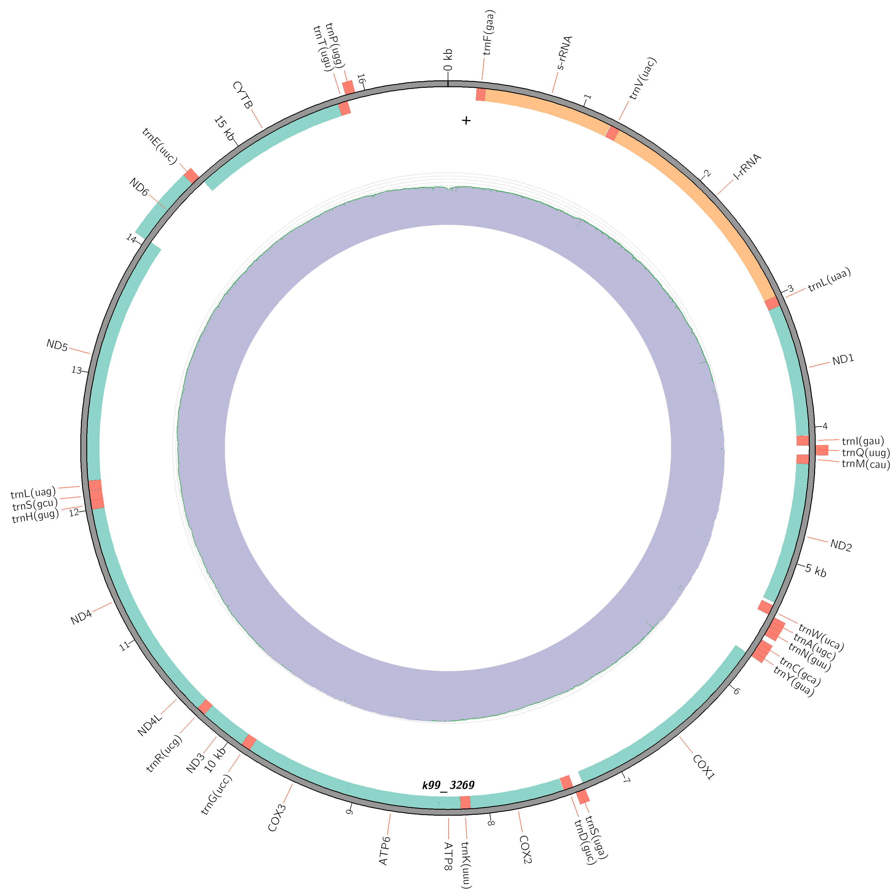

# Assembling the Mitochondrial Genome from Whole Genome Sequencing Data

# Method 1:
These instructions are from Giacomo Bernardi

## 1. Filter anything between 5kb-20kb
```
awk 'BEGIN {OFS = "\n"} {header = $0 ; getline seq ; getline qheader ; getline qseq ; if (length(seq) < 20000) {print header, seq, qheader, qseq}}' /work/gatins/hci_genome/processing/hci1.fastq > HCI_1_dorado0.9.1_lessthan20000bp.fastq
awk 'BEGIN {OFS = "\n"} {header = $0 ; getline seq ; getline qheader ; getline qseq ; if (length(seq) < 20000) {print header, seq, qheader, qseq}}' /work/gatins/hci_genome/processing/hci2.fastq > HCI_2_dorado0.9.1_lessthan20000bp.fastq
```
```
awk 'BEGIN {OFS = "\n"} {header = $0 ; getline seq ; getline qheader ; getline qseq ; if (length(seq) > 5000) {print header, seq, qheader, qseq}}' HCI_1_dorado0.9.1_lessthan20000bp.fastq > HCI_1_dorado0.9.1_lessthan20000bp_morethan5000bp.fastq
awk 'BEGIN {OFS = "\n"} {header = $0 ; getline seq ; getline qheader ; getline qseq ; if (length(seq) > 5000) {print header, seq, qheader, qseq}}' HCI_2_dorado0.9.1_lessthan20000bp.fastq > HCI_2_dorado0.9.1_lessthan20000bp_morethan5000bp.fastq
```
```
cat HCI_1_dorado0.9.1_lessthan20000bp_morethan5000bp.fastq HCI_2_dorado0.9.1_lessthan20000bp_morethan5000bp.fastq > HCI_dorado0.9.1_lessthan20000bp_morethan5000bp.fastq
```

## 2. Assemble
```
#!/bin/bash
#SBATCH -J assembly_flye_mtdna                        # Job name
#SBATCH -p short                            # Partition
#SBATCH -N 1                                # Number of nodes
#SBATCH -n 8                                # Number of tasks/threads
#SBATCH --mem=100G                          # Memory
#SBATCH -o output_%j.txt                    # Standard output file
#SBATCH -e error_%j.txt                     # Standard error file
#SBATCH --mail-user=hughes.annab@northeastern.edu  # Email
#SBATCH --mail-type=BEGIN,END                     # Email notification at job start and completion
#SBATCH --time=48:00:00                     # Maximum run time


# Your program/command here
module load anaconda3/2022.05 discovery
source activate /work/gatins/hci_genome/env
flye --nano-hq HCI_dorado0.9.1_lessthan20000bp_morethan5000bp.fastq --out-dir /work/gatins/hci_genome/processing/mtdna --genome-size 16.8k --threads 8
```

## 3. Look at assembly stats for a circular contig with high coverage
size should be betwen 16K - 32K


Here is a list of contigs that are circular from the Flye assembly. The first one has really high coverage, but the size is about double what we would expect the mitogenome to be based off of the published sequence. Let's try a different method.

# Method 2:
Trying something new. Using raw sequencing reads mapped to mitochondrial genome downloaded from NCBI (see steps in https://github.com/amhughes8/Hciliaris_Genome/blob/main/Holacanthus-ciliaris-Genome-Assembly.md)

## 1. Create fasta file containing all reads that mapped to the mitogenome
extract mapped sequences
```
module load samtools
samtools view -b -F 4 -@ 20 /work/gatins/hci_genome/processing/mtdna/removal/mito_aln.sorted.bam > mapped.bam
```
convert BAM to FASTQ
```
samtools fastq mapped.bam > reads_mito.fastq
```

## 2. Download the singularity container for [MitoZ](https://github.com/linzhi2013/MitoZ)
```
module load singularity
singularity pull MitoZ_v3.6.sif docker://guanliangmeng/mitoz:3.6
```
Make sure everything downloaded correctly using the provided test dataset:
```
mkdir test
cd test
wget -c https://raw.githubusercontent.com/linzhi2013/MitoZ/master/test/test.R1.fq.gz 
wget -c https://raw.githubusercontent.com/linzhi2013/MitoZ/master/test/test.R2.fq.gz
singularity run /work/gatins/hci_genome/processing/mtdna/MitoZ_v3.6.sif mitoz all  \
--outprefix test \
--thread_number 4 \
--clade Chordata \
--genetic_code 2 \
--species_name "Homo sapiens" \
--fq1 test.R1.fq.gz \
--fq2 test.R2.fq.gz \
--fastq_read_length 151 \
--data_size_for_mt_assembly 3,0 \
--assembler megahit \
--kmers_megahit 71 99 \
--memory 50 \
--requiring_taxa Chordata
```
Looks good!

## 3. Run MitoZ on FASTQ file of sequencing reads mapped to reference mitogenome
```
singularity run /work/gatins/hci_genome/processing/mtdna/MitoZ_v3.6.sif mitoz all  \
--outprefix hci_mtdna \
--thread_number 10 \
--clade Chordata \
--genetic_code 2 \
--species_name "Holacanthus ciliaris" \
--fq1 reads_mito.fastq \
--skip_filter \
--assembler megahit \
--kmers_megahit 71 99 \
--memory 50 \
--requiring_taxa Chordata
```

Final assembly in FASTA format: **hci_mtdna_hci_mtdna.megahit.mitogenome.fa_mitoscaf.fa.gbf.fasta**

Resulting circos plot:

